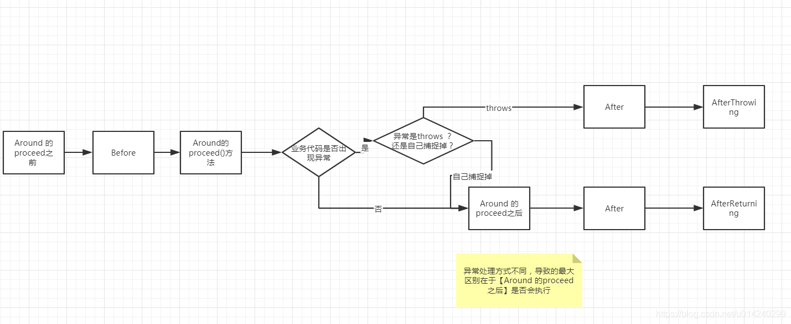
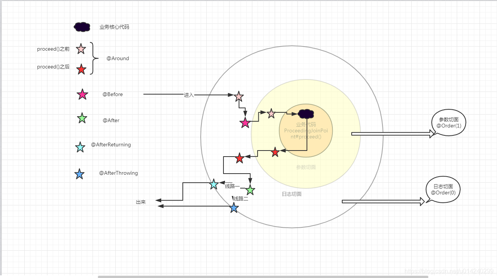

### spring AOP

Aop（Aspect Oriented Programming），面向切面编程

面向切面编程，就是在程序运行时，不改变程序源码的情况下，动态的增强方法的功能，常见的使用场景非常多：
1. 日志
1. 事务
....

相关概念：

| 概念         | 说明                 |
| ------------ | -------------------- |
| 切点         | 要添加代码的地方     |
| 通知（增强） | 向切点动态添加的代码 |
| 切面         | 切点+通知            |
| 连接点       | 切点的定义           |

Java 中的动态代理有两种实现方式：
- cglib
- jdk

其中jdk动态代理必须是基于接口进行代理，也就是我们的目标类必须实现一个接口，才能进行代理。

五种通知:
- 前置通知(before)
- 后置通知(after)
- 异常通知(afterThrowing)
- 返回通知(afterReturning)
- 环绕通知(around)

执行顺序：
> around > before > around > after > afterReturning

切点定义：
- 使用自定义注解
- 使用规则

#### 自定义注解
1. 侵入式的
1. 方法级注解

#### 规则
execution表达式(参考自本工程的`spring-boot-offline`模块)

```
execution(* org.moonzhou..service.*.*(..))
```
* execution 表达式的主体
* 第一个* 代表任意的返回值
* `org.moonzhou` aop所横切的包名
* 包后面.. 表示当前包及其子包
* 第二个* 表示类名，代表所有类
* .*(..) 表示任何方法,括号代表参数 .. 表示任意参数

```
execution(* org.moonzhou.offline.web.execution.EOfflineController.*Off(..))
```
* EOfflineController类下以Off为结尾的方法，任意入参，任意返回

#### 参数传递
> To make argument values available to the advice body, you can use the
  binding form of args. If you use a parameter name in place of a type name in an args expression,
  the value of the corresponding argument is passed as the parameter value when the advice is
  invoked.

> The args(account,..) part of the pointcut expression serves two purposes. First, it restricts
  matching to only those method executions where the method takes at least one parameter, and the
  argument passed to that parameter is an instance of Account. Second, it makes the actual Account
  object available to the advice through the account parameter.

```java
// 方式一
@Before("com.xyz.myapp.CommonPointcuts.dataAccessOperation() && args(account,..)")
public void validateAccount(Account account) {
  // ...
}

// 方式二
@Pointcut("com.xyz.myapp.CommonPointcuts.dataAccessOperation() && args(account,..)")
private void accountDataAccessOperation(Account account) {}
@Before("accountDataAccessOperation(account)")
public void validateAccount(Account account) {
  // ...
}
```

#### 泛型参数传递
```java
public interface Sample<T> {
  void sampleGenericMethod(T param);
  void sampleGenericCollectionMethod(Collection<T> param);
}

@Before("execution(* ..Sample+.sampleGenericMethod(*)) && args(param)")
public void beforeSampleMethod(MyType param) {
  // Advice implementation
}
```

但是不能够使用泛型集合（This approach does not work for generic collections. so you cannot define a pointcut as follow:）
```java
@Before("execution(* ..Sample+.sampleGenericCollectionMethod(*)) && args(param)")
public void beforeSampleMethod(Collection<MyType> param) {
    // Advice implementation
}
```


#### 注解传递
> The proxy object ( this), target object ( target), and annotations ( @within, @target, @annotation, and
  @args) can all be bound in a similar fashion. 

```java
@Retention(RetentionPolicy.RUNTIME)
@Target(ElementType.METHOD)
public @interface Auditable {
  AuditCode value();
}

@Before("com.xyz.lib.Pointcuts.anyPublicMethod() && @annotation(auditable)")
public void audit(Auditable auditable) {
  AuditCode code = auditable.value();
  // ...
}
```

offline里的示例：
```java
@Target(ElementType.METHOD)
@Retention(RetentionPolicy.RUNTIME)
public @interface Offline {
    boolean offline() default true;
}

@Pointcut("@annotation(org.moonzhou.offline.annotation.Offline)")
public void pointcut() {

}
@Before(value="pointcut() && @annotation(offline)")
public void before(JoinPoint joinPoint, Offline offline) {
    // ...
}
```

#### 顺序
1. `@Aspect`配合`@Order`使用，可以控制多个切面的执行顺序（责任链模式）
1. 当然，同一个切面的不同通知的执行顺序也需要主要



#### 其他概念
1. Introductions
1. Aspect Instantiation Models

#### JDBC Template
JdbcTemplate 是 Spring 利用 Aop 思想封装的 JDBC 操作工具。

在查询时，如果使用了 BeanPropertyRowMapper，要求查出来的字段必须和 Bean 的属性名一一对应。如果不一样，则不要使用 BeanPropertyRowMapper，此时需要自定义 RowMapper 或者给查询的字段取别名。


#### 事务
Spring 中的事务主要是利用 Aop 思想，简化事务的配置，可以通过 Java 配置也可以通过 XML 配置。


#### My Hub
```
动态代理示例：
https://github.com/moon-zhou/advanced-java/tree/master/advancedprogramming/src/main/java/org/moonzhou/proxy


org.moonzhou.spring.aop.annotationconfig.aspect.MoonLogAspectV1
和
org.moonzhou.spring.aop.annotationconfig.aspect.MoonLogAspectV2
运行时只能放开已开，避免同时放开输出信息错乱。
但是同时放开，也可以看出多个aop时，是责任链模式，类似filter的特性，先开始的后结束。
```


#### 参考
1. [Spring 学习，看这一篇万余字干货就够了（下）](https://zhuanlan.zhihu.com/p/99183453)