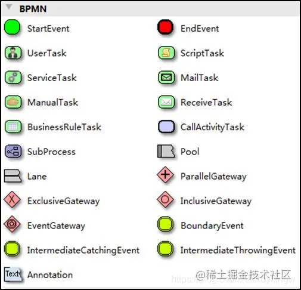
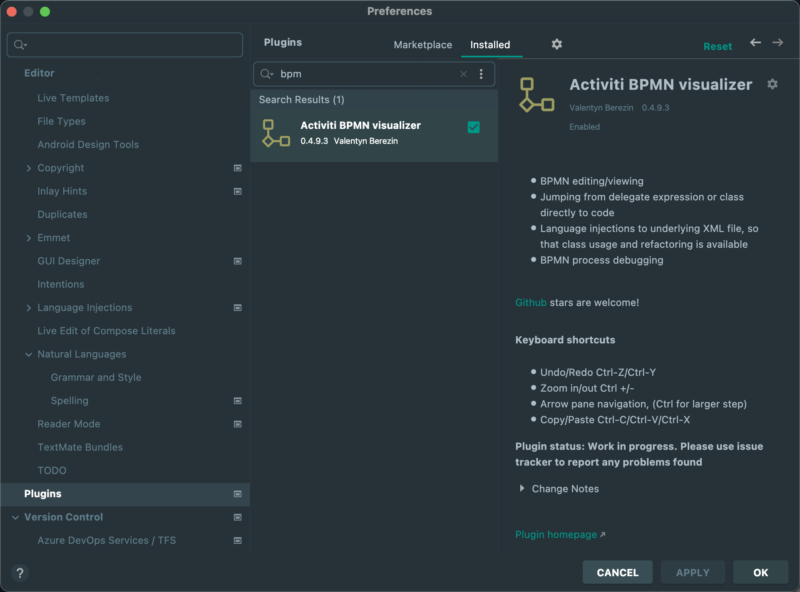
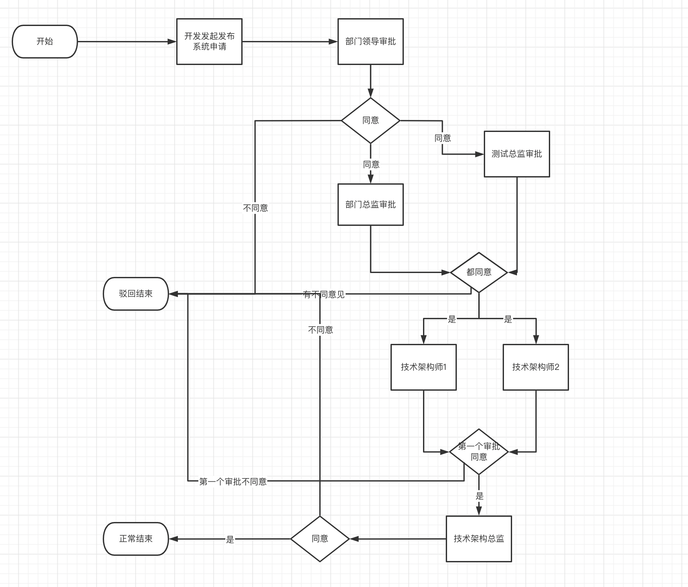

## springboot 集成 activiti7 示例

### 背景
最近入职的公司，做的是企业内部应用，主要用于救助的申请。核心业务就是发起申请，逐层审批，直至审批通过或者审批驳回。

而对于流程本身，需要会签等支持，公司公共流程不支持该功能，因此需要业务系统层面自行实现相关的工作流。

综合市面上通用工作流框架，采用activiti，本demo是关于activiti的集成使用记录，不涉及任何业务关联。

### 工作流 - workflow
工作流是指一类能够完全自动执行的经营过程，根据一系列现成规则，将文档、信息或任务在不同的执行者之间进行传递和执行。简言之就是审批流。

这种业务，大多数都存在于`2B`类的系统中。典型的就是OA。对于简单的审批流程，我们完全可以使用状态跟踪的方式，来控制流程的流转与关联相关的审批人。
但是对于复杂流程，流程引擎的出现，就是将流程本身从业务中进行解耦，更容易进行开发和维护。

### activiti介绍
1. [官网](https://www.activiti.org/)
2. 使用专门的建模语言BPMN2.0进行定义
3. 业务与流程本身的解耦，减少业务系统由于流程变更进行系统改造的工作量，从而减少系统开发维护成本，提高系统的健壮性
4. 实现：
   1. 使用BPMN定义流程
   2. 使用Activiti框架实现流程

### 建模语言BPMN
谈到BPMN，首先就要谈BPM。 BPM即Business Process Managemenet，业务流程管理。是一种规范化的构造端到端的业务流程，以持续的提高组织业务效率。在常见的商业管理教育如EMBA、MBA中都包含了BPM的课程。

而BPMN是Business Process Model And Notation 业务流程模型和符号，就是用来描述业务流程的一种建模标准。BPMN最早由BPMI(BusinessProcess Management Initiative)方案提出。由一整套标准的业务流程建模符号组成。使用BPMN可以快速定义业务流程。

Activiti就是使用BPMN2.0进行流程建模、流程执行管理。

而对于一个完整的BPMN图形流程，其实最终是通过XML进行描述的。通常，会将BPMN流程最终保存为一个.bpmn的文件，然后可以使用文本编辑器打开进行查看。而图形与xml文件之间，会有专门的软件来进行转换。

#### 基础元件
| 流程任务                 | 属性                                                       |
| :----------------------- | :--------------------------------------------------------- |
| Service Task（服务任务） | 可以用于调外部服务或自动执行程序。                         |
| Send Task（发送任务）    | 用于处理外部流程参与人发送消息的工作。eg：EmailTask。      |
| Receive Taks（接收任务） | 等待外部流程参与者发送消息的任务。                         |
| User Task（用户任务）    | 表示需要人参与的任务，可以配置候选人/组/代理人等。         |
| Script Task（脚本任务）  | 用于执行定义好的脚本程序，流程执行到这个结点自动执行脚本。 |

### activiti接入 - 使用starter方式
1. 引入依赖
2. 定义流程
3. 实现流程
4. 业务功能验证：流程开始-流程结束，包含各个不同的分支情况。

#### 环境要求
1. JDK 8+
2. MYSQL 5+

#### 引入依赖

#### 定义流程
1. 安装插件
  IDEA Ultimate，插件中搜索`actiBPM`，但是在2022.1.1中已经搜不到，换了一个插件使用。`Activiti BPMN visualizer`.
  
2. 设计工作流，业务流程图如下：
  

### 参考
1. [Activit7整合Spring、SpringBoot快速精通|8月更文挑战](https://juejin.cn/post/6994236150789439518)
2. [idea2021中Activiti BPMN visualizer简单使用](https://blog.csdn.net/qq_51726114/article/details/124363712)
3. [BPMN2.0解析](https://www.jianshu.com/p/6f38a0275e98)
4. [BPMN 2.0规范](https://juejin.cn/post/6941989026711175182)