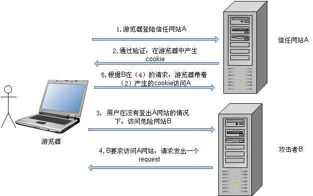

### CSRF
本项目为CSRF示例，使用springboot，为简化示例，不涉及持久层。

#### 简介
跨站请求伪造（英语：`Cross-site request forgery`），也被称为 `one-click attack` 或者 `session riding`，通常缩写为 `CSRF` 或者 `XSRF`， 是一种挟制用户在当前已登录的Web应用程序上执行非本意的操作的攻击方法。

技术上来说，不局限于被攻击请求是否需要登录（临时会话关联也存在该风险），但从实际出发，对攻击者而言，有价值的请求往往都是用户级的，受限访问的，需要用户登录的。
而且用户级的数据更重要，因此也就成为CSRF的主要攻击类型。

从现象上来看：
攻击者盗用了你的身份，以你的名义发送恶意请求，对服务器来说这个请求是完全合法的，但是却完成了攻击者所期望的一个操作，比如以你的名义发送邮件、发消息，盗取你的账号，添加系统管理员，甚至于购买商品、虚拟货币转账等。

#### CSRF的过程
以登录会话通过cookie来进行关联的方案进行描述：
1. 用户C打开浏览器，访问受信任网站A，输入用户名和密码请求登录网站A
1. 在用户信息通过验证后，网站A产生Cookie信息并返回给浏览器，此时用户登录网站A成功，可以正常发送请求到网站A
1. 用户未退出网站A之前，在同一浏览器中，打开一个TAB页访问网站B
1. 网站B接收到用户请求后，~~返回一些攻击性代码，~~并发出一个请求要求访问第三方站点A（不一定需要攻击性代码）
1. ~~浏览器在接收到这些攻击性代码后，~~根据网站B的请求，在用户不知情的情况下携带Cookie信息，向网站A发出请求。网站A并不知道该请求其实是由B发起的，所以会根据用户C的Cookie信息以C的权限处理该请求，导致来自网站B的~~恶意代码~~（请求）被执行

#### 漏洞检测
抓取一个正常请求的数据包，去掉Referer字段后再重新提交，如果该提交还有效，那么基本上可以确定存在CSRF漏洞。

检测工具，如CSRFTester，CSRF Request Builder等。

#### CSRF的原理
1. HTTP请求本身是无状态的，用户如何在多次操作的时候，进行关联呢？一般的登录方案里，都会使用功能cookie来保存用户多次请求的会话关联ID。而这个过程，就是信任cookie会话。
1. 业务系统的请求本身可以被重复请求，一旦可以重复请求，说明不需要用户进行交互，也就是不需要用户进行相关的验证。隐藏的也是信任已经登录的会话。
1. 业务相关，代码实现相关的漏洞类型。（也就是后面防御的点）

所以，CSRF漏洞的本质，是重要操作的所有参数都是可以被攻击者猜测到的（或者通过其他请求获取到）。

因此，防御的解决方案就是打破漏洞的本质即可：比如参数加密传输，或者使用一些随机数，从而让攻击者无法猜测到参数值。
这是“不可预测性原则”的一种应用。

但是此方法，也存在一些不友好的地方。如：
* 加密或者混淆后的URL变得非常难度，对用户不友好
* 加密的参数每次都改变，某些URL将无法再被用户收藏。
* 普通的参数如果也被加密或者哈希，将会给数据分析工作带来很大的困扰，因为数据分析工作长城需要用到参数的明文。

#### 防御手段
1. 验证码：常见有短信验证码，各类拼图，滑块等。同时可以放大到一些业务信息上的验证，比如密码，证件号等。**本质还是通过交互性数据来阻止脚本自动构造数据和请求。**
1. Referer Check：因为业务（页面）的上下文是有一定的关联的，所以每个正常请求的Referer具有一定的规律。缺陷：很多时候取不到Referer，或者构造Referer。不推荐作为防御的手段，但是作为监控CSRF攻击的发生，倒是可行的方法。
1. Anti CSRF Token：保持原参数不变，新增一个参数Token

#### 实际攻击场景
1. web邮件系统：攻击性邮件里包含了发起邮件删除的请求。当用户收到这类请求时，打开邮件，页面就会发起删除邮件的请求。
1. 类似第一点里面的攻击场景，还可能有站内信，公告板，留言评论等（此类场景里也是XSS存在场景）。比如百度用户中心发送短消息功能：
    1. 暴露了可以查询用户所有好友的接口
    1. 暴露了发送短消息接口
    1. 结合第一点和第二点，就可以编写具有攻击逻辑的代码。包装成一个页面部署在攻击者的服务器上。
    1. 准备工作结束后，只需要引导一个百度用户查看恶意页面后。就会使得攻击生效，给这个用户的所有好友发送一条短消息。而这条短消息中的内容又包含一张图片（图片标签），标签地址指向CSRF页面，使得这些好友再次将消息发给他们的好友。（蠕虫-worm）

#### 注入实例
1. 示例运行顺序
1. 示例攻击过程

#### MyHub

#### cookie
浏览器所持有的Cookie分为两种：一种是`“Session Cookie”`，又称“临时Cookie”；另一种是`“Third-party Cookie”`，也称为“本地Cookie”。

`“Third-party Cookie”`：服务器再`Set-Cookie`时指定了`Expire`时间，只有到了`Expire`时间之后Cookie才会失效，所以这种Cookie会保存在本地。

`“Session Cookie”`：没有指定`Expire`时间，所以浏览器关闭之后，`Session Cookie`就失效了。

另外，不同的浏览器或者相同浏览器的不同版本，都对于Cookie有不同的的表现。需要根据实际情况来进行相关脚本的调整。

#### 参考
1. 白帽子讲Web安全
1. [什么是CSRF攻击？如何防御CRSF攻击？](https://blog.csdn.net/wk52525/article/details/107859685)
