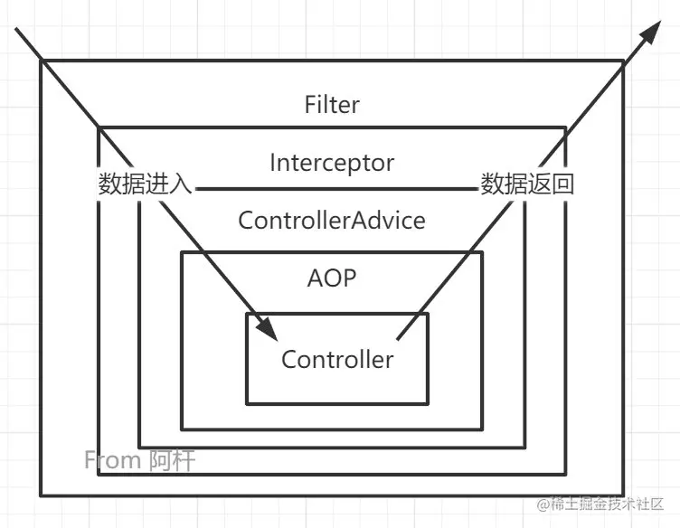
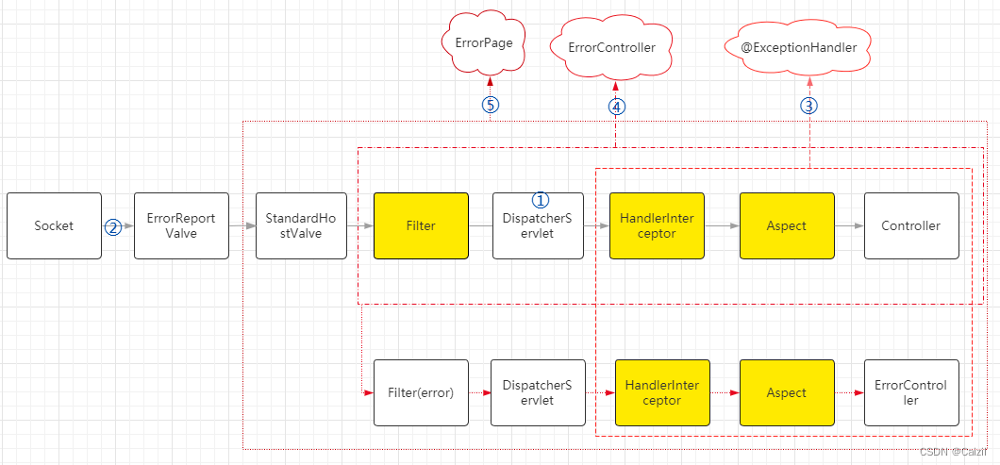

执行顺序是：Filter过滤器 > Interceptor拦截器 > ControllerAdvice > AOP。
解释：Filter和Interceptor的执行顺序是可以直接看出来的，AOP、ControllerAdvice 的执行顺序得看getAll的后面，getAll是controller输出的内容嘛，它的下一条是aop，然后才是异常被捕获，反方向先执行，说明 ControllerAdvice 是在 AOP 外面一层的。
这里也可以看出来，当抛出的异常被 ControllerAdvice 捕获之后， Interceptor 拦截器不会再有后置处理了，但是Filter过滤器还是有后置处理的。

[参考](https://juejin.cn/post/7153055158610427934)

