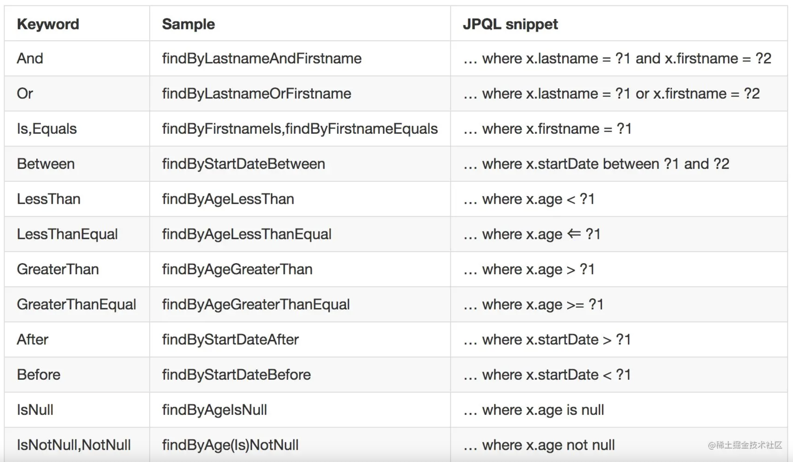

# springboot jpa

## 介绍

`JPA（Java Persistence API）` Java 持久化 API，它是一套 ORM 规范，而不是具体地实现，JPA 的江湖地位类似于 JDBC，只提供规范，所有的数据库厂商提供实现（即具体的数据库驱动），最典型的实现就是`Hibernate`（Red Hat的实现）。
除此之外，其他一些 `ORM` 框架(支持 JPA2.0 规范)，例如：

- Batoo JPA
- DataNucleus (formerly JPOX)
- EclipseLink (formerly Oracle TopLink)
- IBM, for WebSphere Application Server
- JBoss with Hibernate
- Kundera
- ObjectDB
- OpenJPA
- OrientDB from Orient Technologies
- Versant Corporation JPA (not relational, object database)

## 使用
1. 引入依赖: pom.xml
   - springboot依赖
   - 数据库驱动依赖（多数据源时，如果数据库类型不同，需要分别引入）
   - jpa依赖
   - 其他（lombok，test等）
2. 配置: application.yml
   - 数据源（多数据源，配置项名称需要注意，与单数据源不一致，详见注意点）
   - jpa（打印sql，自动建表等）
3. 初始化
   - 数据源: `org.moonzhou.jpa.config.DataSourceConfig`
   - jpa（scan Entity及Repository）: `org.moonzhou.jpa.config.PrimaryJpaConfig` 和 `org.moonzhou.jpa.config.SecondJpaConfig`
4. 使用
   - Entity（定义与数据库的映射实体类，字段名，表名等）
   - Repository（继承JpaRepository）：继承，有通用方法，例如保存，更新，删除，分页查询等，类似Mybatis。
     
   - sql注解
     > 使用 `@Query` 注解，在注解中写自己的 SQL，默认使用的查询语言不是 SQL，而是 JPQL，这是一种数据库平台无关的面向对象的查询语言，有点定位类似于 `Hibernate` 中的 HQL，在 `@Query` 注解中设置 nativeQuery 属性为 true 则表示使用原生查询，即大伙所熟悉的 SQL。
     > 
     > 如果是插入/更新/删除操作，则需要添加 `@Modifying` 注解。

## 注意点
1. 配置多数据源时，需要注意使用`jdbc-url`还是`url`
2. 多数据源操作的时候，同一个entity实例即使是不同数据源的`EntityManager`，也不能进行操作：`org.hibernate.PersistentObjectException: detached entity passed to persist`
3. 数据源指定配置类中只有一个类中的方法添加 `@Primary`， 另外一个不要加这个注解。（jpa初始化）
4. mysql数据库，如果不配置使用方言，自动创建表的时候会使用 MyISAM 做表的引擎，如果配置了数据库方言为 MySQL57Dialect，则使用 InnoDB 做表的引擎。
5. `@Entity` 注解的 `name` 属性表示自定义生成的表名，当然也可以使用 `@Table`进行指定。
6. 对于多数据源时，可能有相同的表操作，可以提取公共的repository，各自的jpa repository进行继承使用。（公共的repository无法被多次注入jpa）

## 参考
1. [SpringBoot集成JPA](https://juejin.cn/post/7228559708075573285)
2. [Spring Boot2 系列教程(二十四)Spring Boot 整合 Jpa](https://juejin.cn/post/6844903705968377869)
3. [SpringBoot-JPA多数据源](https://blog.csdn.net/zZZ251682553/article/details/125105388)
