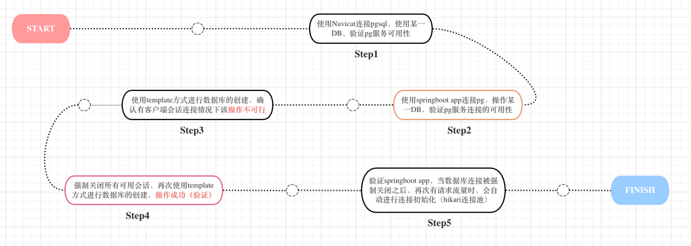
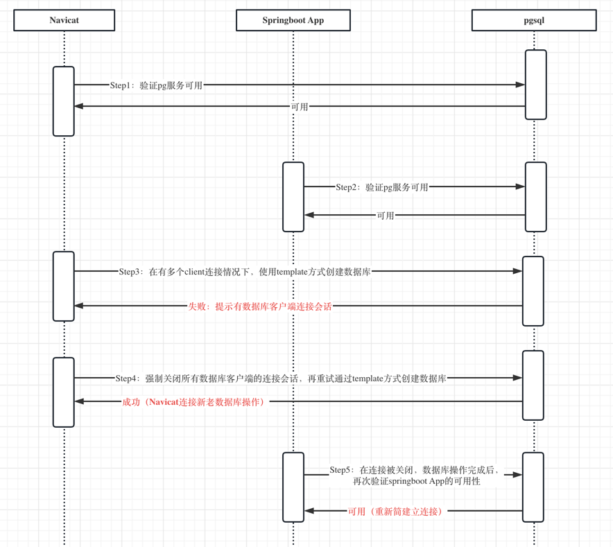
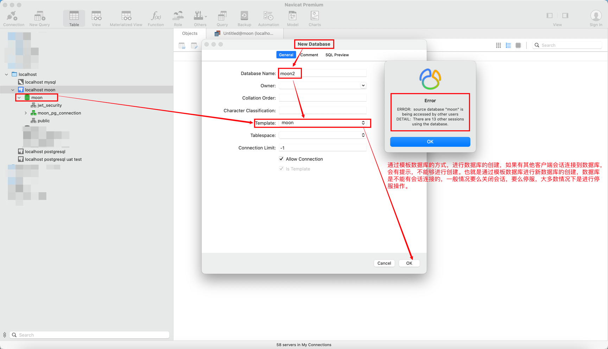

## pg connection
### 背景
在公司数字化过程中，大型应用面对人员交替，团队变更，比如我们团队加入了某个应用的开发，为了避免和原开发团队的环境及代码冲突，提高整体的开发效率，我们采用重新搭建专供自己使用的环境（配套的git flow变更就是有单独的开发分支）。

在k8s上创建好独立的`namespace`，部署好应用之后，底层数据也是一个问题，是否使用相同的测试数据库？To be， or not to be。考虑到如果进入全面开发后，可能也存在数据冲突的情况，因此也考虑将数据进行独立。

最初使用`Navicat`自带的`数据传输`功能，进行数据的迁移，但有部分视图以及大量函数存在权限问题，无法进行迁移。后来发现可以Template的方式新建数据库，但是该方式在迁移过程是不能有客户端session连接的。
本示例就是验证该方案的可行性，即在强制关闭应用的数据库连接之后（直接关连接或者停应用），数据库完成迁移，原应用是否能够正常提供服务。

### 准备
1. pgsql
2. Navicat
3. springboot App（本示例）
   1. jdk
   2. springboot（默认hikari数据库连接池）
   3. mybatis-plus
   4. lombok
   5. sql：dml/ddl

```
CREATE DATABASE moon;

-- ----------------------------
-- Table structure for t_user
-- ----------------------------
DROP TABLE IF EXISTS "moon_pg_connection"."t_user";
CREATE TABLE "moon_pg_connection"."t_user" (
"id" int8 NOT NULL,
"name" varchar(255) COLLATE "pg_catalog"."default",
"age" int4,
"email" varchar(255) COLLATE "pg_catalog"."default",
"create_time" timestamp(6)
)
;
ALTER TABLE "moon_pg_connection"."t_user" OWNER TO "moon";

-- ----------------------------
-- Records of t_user
-- ----------------------------
BEGIN;
INSERT INTO "moon_pg_connection"."t_user" VALUES (2, 'moon2', 28, '2@2.2', '2023-05-24 09:34:26');
INSERT INTO "moon_pg_connection"."t_user" VALUES (1, 'moon1', 18, '1@1.1', '2023-05-23 16:29:58');
INSERT INTO "moon_pg_connection"."t_user" VALUES (3, 'moon3', 38, '3@3.3', '2023-05-24 09:34:44');
COMMIT;

-- ----------------------------
-- Primary Key structure for table t_user
-- ----------------------------
ALTER TABLE "moon_pg_connection"."t_user" ADD CONSTRAINT "t_user_pkey" PRIMARY KEY ("id");
```

### 操作步骤



#### Step1
正常Navicat连接，正常查询即可。

#### Step2
创建简单的应用，连接数据库，提供http接口，通过http访问，最终可以正常查询到数据库数据即可，也就是本示例，详细代码位置：
```
org.moonzhou.pgconnection.controller.TestController.getUser
```

#### Step3

```
ERROR:  source database "moon" is being accessed by other users
DETAIL:  There are 13 other sessions using the database.
```

#### Step4
强制关闭会话（需要关注Navicat客户端，确保都手动关闭掉）
```
select pg_terminate_backend(pid) from (select pid from pg_stat_activity where datname = 'moon' ) a;

or

SELECT pg_terminate_backend(pg_stat_activity.pid)
FROM pg_stat_activity
WHERE datname='moon' AND pid<>pg_backend_pid();
```
如果数据库使用明确，也可以直接停应用。

#### Step5
重新测试**Step2**，业务正常，**同时会有提示重新创建数据库连接**，信息如下：
```
Creating a new SqlSession
SqlSession [org.apache.ibatis.session.defaults.DefaultSqlSession@4ac18cb3] was not registered for synchronization because synchronization is not active
2023-05-24 09:57:03.144  WARN 5722 --- [io-8080-exec-10] com.zaxxer.hikari.pool.PoolBase          : HikariPool-1 - Failed to validate connection org.postgresql.jdbc.PgConnection@5aa2d8c5 (This connection has been closed.). Possibly consider using a shorter maxLifetime value.
2023-05-24 09:57:03.154  WARN 5722 --- [io-8080-exec-10] com.zaxxer.hikari.pool.PoolBase          : HikariPool-1 - Failed to validate connection org.postgresql.jdbc.PgConnection@2c8525fe (This connection has been closed.). Possibly consider using a shorter maxLifetime value.
2023-05-24 09:57:03.156  WARN 5722 --- [io-8080-exec-10] com.zaxxer.hikari.pool.PoolBase          : HikariPool-1 - Failed to validate connection org.postgresql.jdbc.PgConnection@1790f72c (This connection has been closed.). Possibly consider using a shorter maxLifetime value.
2023-05-24 09:57:03.159  WARN 5722 --- [io-8080-exec-10] com.zaxxer.hikari.pool.PoolBase          : HikariPool-1 - Failed to validate connection org.postgresql.jdbc.PgConnection@3076a23a (This connection has been closed.). Possibly consider using a shorter maxLifetime value.
2023-05-24 09:57:03.162  WARN 5722 --- [io-8080-exec-10] com.zaxxer.hikari.pool.PoolBase          : HikariPool-1 - Failed to validate connection org.postgresql.jdbc.PgConnection@5702f419 (This connection has been closed.). Possibly consider using a shorter maxLifetime value.
2023-05-24 09:57:03.166  WARN 5722 --- [io-8080-exec-10] com.zaxxer.hikari.pool.PoolBase          : HikariPool-1 - Failed to validate connection org.postgresql.jdbc.PgConnection@52ad91d2 (This connection has been closed.). Possibly consider using a shorter maxLifetime value.
2023-05-24 09:57:03.168  WARN 5722 --- [io-8080-exec-10] com.zaxxer.hikari.pool.PoolBase          : HikariPool-1 - Failed to validate connection org.postgresql.jdbc.PgConnection@4294353c (This connection has been closed.). Possibly consider using a shorter maxLifetime value.
2023-05-24 09:57:03.173  WARN 5722 --- [io-8080-exec-10] com.zaxxer.hikari.pool.PoolBase          : HikariPool-1 - Failed to validate connection org.postgresql.jdbc.PgConnection@47f63826 (This connection has been closed.). Possibly consider using a shorter maxLifetime value.
2023-05-24 09:57:03.189  WARN 5722 --- [io-8080-exec-10] com.zaxxer.hikari.pool.PoolBase          : HikariPool-1 - Failed to validate connection org.postgresql.jdbc.PgConnection@794befd (This connection has been closed.). Possibly consider using a shorter maxLifetime value.
2023-05-24 09:57:03.206  WARN 5722 --- [io-8080-exec-10] com.zaxxer.hikari.pool.PoolBase          : HikariPool-1 - Failed to validate connection org.postgresql.jdbc.PgConnection@39099cdc (This connection has been closed.). Possibly consider using a shorter maxLifetime value.
JDBC Connection [HikariProxyConnection@1515676436 wrapping org.postgresql.jdbc.PgConnection@2c164770] will not be managed by Spring
```