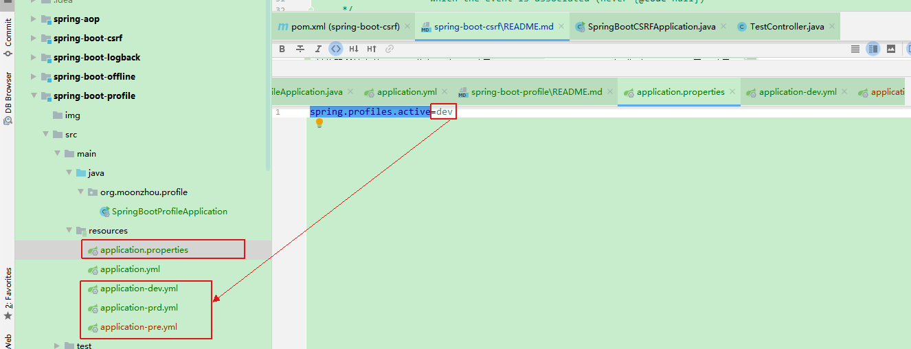
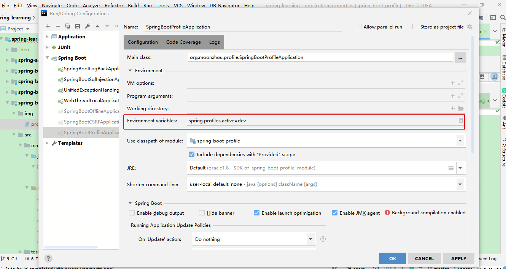
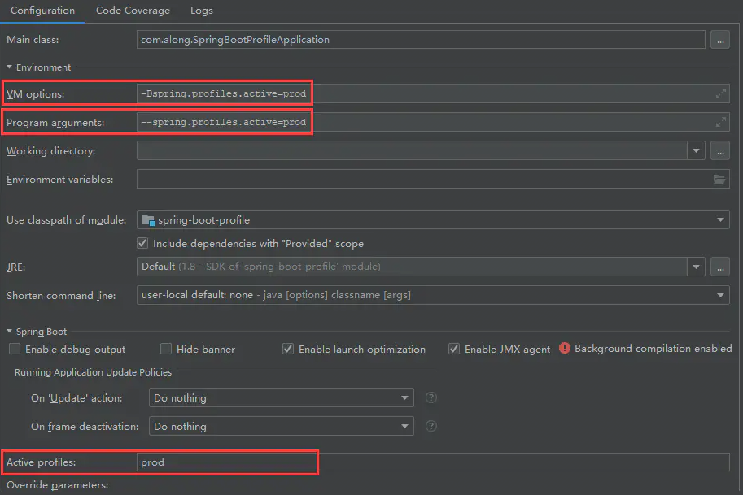
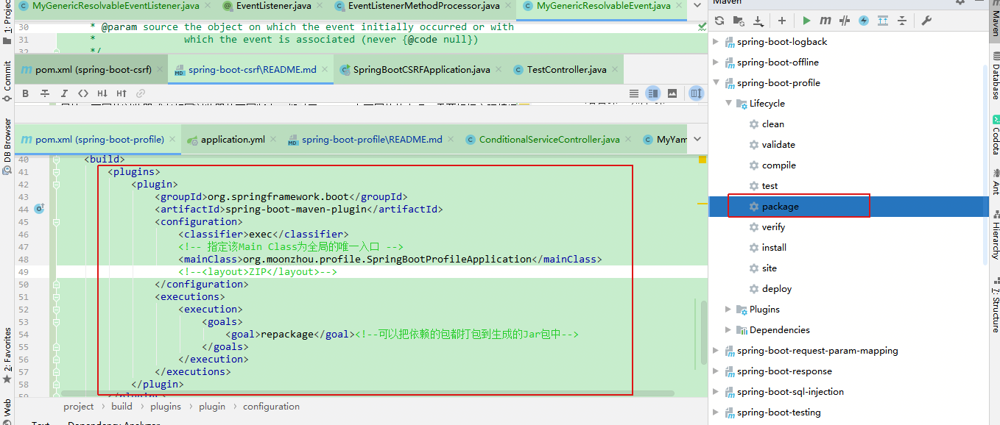

### spring-boot-profile
springboot里profile的特性使用

#### profile配置文件区分环境
##### 通过不同配置文件
1. springboot通用配置文件，配置内容选择需要的配置文件：`spring.profiles.active=dev`。
    * 配置在`application.properties`或者`application.yml`
    * 或者在环境变量里配置对应的值即可
    * VM options设置启动参数 `-Dspring.profiles.active=prod`
    * Program arguments设置 `--spring.profiles.active=prod` ()
1. 创建对应环境的配置文件：`application-dev.yml`/`application-pre.yml`/`application-prd.yml`





**以上两种方式，选择一种即可，测试时，适当删除其中一种。**
**如果对应的配置文件没有，则使用默认的配置。**

##### 通过application.yml配置
直接在一个yml配置里配置上各个环境的区分变量，同时使用`---`进行区分即可。
```yml
spring:
  profiles:
    active: prd

server:
  port: 8080


---
spring:
  profiles: dev
server:
  port: 8081
---
spring:
  profiles: pre
server:
  port: 8082
---
spring:
  profiles: prd
server:
  port: 8083
```
#### 扩展application.yml的自定义配置
1. 新增配置文件，与springboot的标准配置文件同目录（e.g.`application.yml`），且配置文件名称格式为`application-XXX.yml`，如本示例里面的`application-security.yml`
1. 在`application.yml`文件中加上配置：
    ```yml
   spring:
     profiles:
       include: # 该值为列表，可以配置多个，此示例只使用了一个
         - security
         - XXX
   ```
1. 创建自动配置类，也就是配置对应的配置bean，此示例结合lombok，最大程度减少了代码量：
    ```java
    @Data
    @Configuration
    @ConfigurationProperties(prefix = "security")
    public class Security {
        private String system;
    
        private String key;
    }
    
    ```
1. 使用的地方直接注入配置bean即可。
    ```java
    @Autowired
    private Security security;
    ```
1. 如果配置在springboot的标准配置文件里，比如`application.yml`，直接创建配置bean和通过注解使用，不需要额外配置。
1. 当然，对于上述的配置，均可以直接使用`@Value`进行直接使用。但是对于具体业务而言，更倾向于使用抽象配置文件以及抽象对应配置bean的方式。配置独立，标准配置文件配置springboot等组件类配置，避免配置内容繁杂，配置项“爆照”，无法维护。

#### 引申自定义配置
1. 配置目录下创建yml文件：`duts.yml`
1. 创建配置文件对应的POJO：`Duts.java`
    ```java
    @Data
    @Configuration
    @ConfigurationProperties(prefix = "duts")
    @PropertySource(value = "classpath:duts.yml", factory = MyYamlPropertySourceFactory.class)
    public class Duts {
        private String account;
    
        private String keyId;
    
        private String keySecret;
    }
    ```
1. 创建对应的自定义的`PropertySourceFactory`，继承自`PropertySourceFactory`：
    ```
    org.moonzhou.profile.config.factory.MyYamlPropertySourceFactory
    此示例需要注意，有多种实现方式，根本在于创建出PropertySource
    ```
1. springboot 在1.5版本以后，`@ConfigurationProperties`去除location参数，因此无法直接导出yml配置文件，
而properties配置文件可以通过`@PropertySource`或者`@ImportResource` 来直接导入，上述的示例就是通过`@PropertySource`。
也可以通过`@ImportResource`方式，即：
```java
// org.moonzhou.profile.config.CustomizedConfig
@Configuration
public class CustomizedConfig {

    // 加载YML格式自定义配置文件
    /*@Bean
    public static PropertySourcesPlaceholderConfigurer properties() {
        PropertySourcesPlaceholderConfigurer configurer = new PropertySourcesPlaceholderConfigurer();
        YamlPropertiesFactoryBean yaml = new YamlPropertiesFactoryBean();
        yaml.setResources(new ClassPathResource("duts.yml"));//File引入
        configurer.setProperties(yaml.getObject());
        return configurer;
    }*/
}
```
1. 本代码示例使用`@PropertySource`实现，`@ImportResource`方式被注释（容易注释），可以根据自己的需要，自行放开对应的注释。

#### profile区分不同的服务
1. 创建服务接口：`HelloService`
2. 针对服务，进行不同环境的实现，同时添加上`@Profile`，值为各个环境的区分值：`PrdHelloServiceImpl`和`DevHelloServiceImpl`
3. 使用的地方，直接注入即可：`ConditionalServiceController`
1. 任何`@Component`或`@Configuration`注解的类都可以使用`@Profile`注解

#### maven打包区分环境
1. maven配置:`spring-boot-profile/pom.xml`
    1. 添加profile配置
    1. 添加需要maven渲染的目录（打包时统一替换变量）：
        ```
        properties文件使用：${select.config}
        yml文件使用：@select.config@
        ```
    1. 添加打包配置
1. 打包：`mvn clean package -P dev`
1. 运行jar包：`java -jar spring-boot-profile-0.0.1-SNAPSHOT-exec.jar`


#### MyHub
1. 
2. springboot多环境配置测试过程
    * 测试时因为配置方式多种，为了避免多种方式之间的干扰，运行示例时，确保只有一种配置生效，注释掉其他的配置。
    * 直接启动该springboot示例即可。
1. 自定义配置测试过程
    * 配置到组件扩展的文件里application-xxx.yml，通过绑定POJO使用，访问：`http://localhost:8083/customized/config/security`
    * 配置到组件配置文件application.yml，通过绑定POJO使用，访问：`http://localhost:8083/customized/config/system`
    * 配置到组件配置文件application.yml，通过注解`@Value`使用，访问：`http://localhost:8083/customized/config/value`
    * 单独配置yml文件，通过绑定POJO使用，访问：`http://localhost:8083/customized/config/single`
1. 使用springboot打包，通过命令进行测试(打包不区分环境，运行时区分环境)：
    * 添加打包配置
    * 执行打包：通过IDEA maven插件可视化打包，也可以执行命令`mvn clean package`
    * 运行命令后，测试相关服务:`java -jar spring-boot-profile-0.0.1-SNAPSHOT-exec.jar --spring.profiles.active=prd`
        
    
#### 参考
1. [spring boot profile配置和启动时no active profile set, falling back to default profiles: default的问题](https://blog.csdn.net/benbenniaono1/article/details/105632264)
1. [Spring Boot添加自定义yml文件配置](https://blog.csdn.net/u013314786/article/details/87975279)
1. [springboot 自定义yml 配置文件](https://www.e-learn.cn/topic/1350377)
1. [SpringBoot2(二)：Profile使用](https://www.jianshu.com/p/99dd27da31dd)