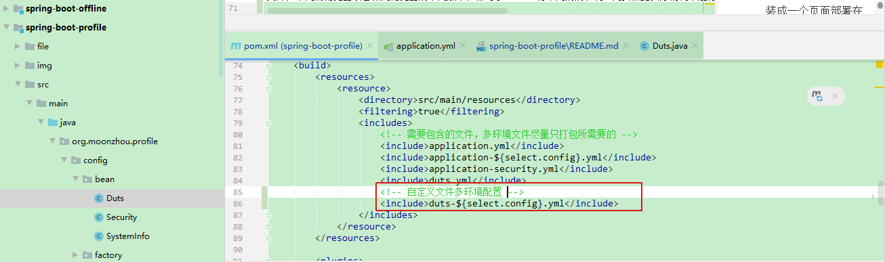
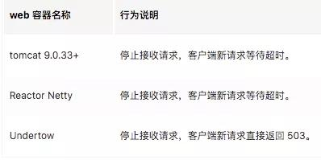
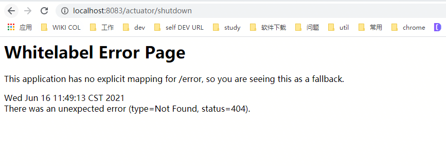
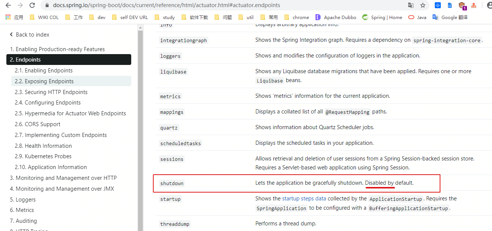
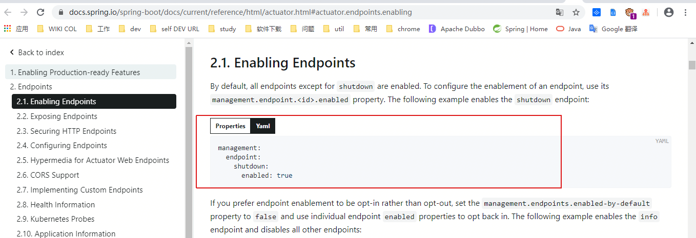
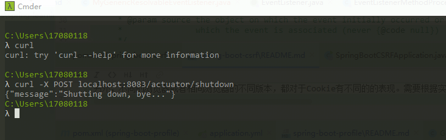
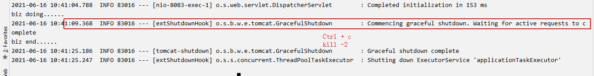

### spring-boot-profile
springboot里profile的特性使用

#### profile配置文件区分环境
##### 通过不同配置文件
1. springboot通用配置文件，配置内容选择需要的配置文件：`spring.profiles.active=dev`。
    * 配置在`application.properties`或者`application.yml`
    * 或者在环境变量里配置对应的值即可
    * VM options设置启动参数 `-Dspring.profiles.active=prod`
    * Program arguments设置 `--spring.profiles.active=prod` ()
1. 创建对应环境的配置文件：`application-dev.yml`/`application-pre.yml`/`application-prd.yml`


**以上两种方式，选择一种即可，测试时，适当删除其中一种。**
**如果对应的配置文件没有，则使用默认的配置。**

##### 通过application.yml配置
直接在一个yml配置里配置上各个环境的区分变量，同时使用`---`进行区分即可。
```yml
spring:
  profiles:
    active: prd

server:
  port: 8080


---
spring:
  profiles: dev
server:
  port: 8081
---
spring:
  profiles: pre
server:
  port: 8082
---
spring:
  profiles: prd
server:
  port: 8083
```
#### 扩展application.yml的自定义配置
1. 新增配置文件，与springboot的标准配置文件同目录（e.g.`application.yml`），且配置文件名称格式为`application-XXX.yml`，如本示例里面的`application-security.yml`
1. 在`application.yml`文件中加上配置：
    ```yml
   spring:
     profiles:
       include: # 该值为列表，可以配置多个，此示例只使用了一个
         - security
         - XXX
   ```
1. 创建自动配置类，也就是配置对应的配置bean，此示例结合lombok，最大程度减少了代码量：
    ```java
    @Data
    @Configuration
    @ConfigurationProperties(prefix = "security")
    public class Security {
        private String system;
    
        private String key;
    }
    
    ```
1. 使用的地方直接注入配置bean即可。
    ```java
    @Autowired
    private Security security;
    ```
1. 如果配置在springboot的标准配置文件里，比如`application.yml`，直接创建配置bean和通过注解使用，不需要额外配置。
1. 当然，对于上述的配置，均可以直接使用`@Value`进行直接使用。但是对于具体业务而言，更倾向于使用抽象配置文件以及抽象对应配置bean的方式。配置独立，标准配置文件配置springboot等组件类配置，避免配置内容繁杂，配置项“爆照”，无法维护。

#### 引申自定义配置
1. 配置目录下创建yml文件：`duts.yml`
1. 创建配置文件对应的POJO：`Duts.java`
    ```java
    @Data
    @Configuration
    @ConfigurationProperties(prefix = "duts")
    @PropertySource(value = "classpath:duts.yml", factory = MyYamlPropertySourceFactory.class)
    public class Duts {
        private String account;
    
        private String keyId;
    
        private String keySecret;
    }
    ```
1. 创建对应的自定义的`PropertySourceFactory`，继承自`PropertySourceFactory`：
    ```
    org.moonzhou.profile.config.factory.MyYamlPropertySourceFactory
    此示例需要注意，有多种实现方式，根本在于创建出PropertySource
    ```
1. springboot 在1.5版本以后，`@ConfigurationProperties`去除location参数，因此无法直接导出yml配置文件，
而properties配置文件可以通过`@PropertySource`或者`@ImportResource` 来直接导入，上述的示例就是通过`@PropertySource`。
也可以通过`@ImportResource`方式，即：
```java
// org.moonzhou.profile.config.CustomizedConfig
@Configuration
public class CustomizedConfig {

    // 加载YML格式自定义配置文件
    /*@Bean
    public static PropertySourcesPlaceholderConfigurer properties() {
        PropertySourcesPlaceholderConfigurer configurer = new PropertySourcesPlaceholderConfigurer();
        YamlPropertiesFactoryBean yaml = new YamlPropertiesFactoryBean();
        yaml.setResources(new ClassPathResource("duts.yml"));//File引入
        configurer.setProperties(yaml.getObject());
        return configurer;
    }*/
}
```
1. 本代码示例使用`@PropertySource`实现，`@ImportResource`方式被注释（容易注释），可以根据自己的需要，自行放开对应的注释。

#### profile区分不同的服务
1. 创建服务接口：`HelloService`
2. 针对服务，进行不同环境的实现，同时添加上`@Profile`，值为各个环境的区分值：`PrdHelloServiceImpl`和`DevHelloServiceImpl`
3. 使用的地方，直接注入即可：`ConditionalServiceController`
1. 任何`@Component`或`@Configuration`注解的类都可以使用`@Profile`注解

#### maven打包区分环境
1. maven配置:`spring-boot-profile/pom.xml`
    1. 添加profile配置
    1. 添加需要maven渲染的目录（打包时统一替换变量）：
        ```
        properties文件使用：${select.config}
        yml文件使用：@select.config@
        ```
    1. 添加打包配置
1. 打包
    * 通过profile的id：`mvn clean package -P dev`
    * 通过参数设置：`mvn clean package -Dselect.config=prd`
1. 运行jar包：`java -jar spring-boot-profile-0.0.1-SNAPSHOT-exec.jar`

#### 自定义文件区分环境
1. 如果是最终打包，自定义配置也可以通过环境后缀来进行区分打包，只不过需要重新修改下文件名。不能添加后缀，因为代码里加载的配置文件名是不包含环境的。
    ```java
    @PropertySource(value = "classpath:duts.yml", factory = MyYamlPropertySourceFactory.class)
    ```
    
1. 拆分为application-XXX-${ENV}.yml配置。
1. 定义bean的基类，同时根据对应环境进行继承，每个继承类使用`@Profile("xxx")`来区分环境初始化，当然选线在bean上的注解都需要下移到具体子类上(`@ConfigurationProperties`等)。

#### 其他配置
1. yml里的各类数据结构配置，类嵌套配置，参数引用(`${}`)等
1. 加载配置时添加校验`@Validated`
1. 

#### 优雅关机
##### 目的
如果没有优雅停机，服务器此时直接直接关闭(kill -9)，那么就会导致当前正在容器内运行的业务直接失败，在某些特殊的场景下产生脏数据。

优雅停机后：在服务器执行关闭（kill -2）时，会预留一点时间使容器内部业务线程执行完毕，此时容器也不允许新的请求进入。新请求的处理方式跟web服务器有关，Reactor Netty、 Tomcat将停止接入请求，Undertow的处理方式是返回503。


> Graceful shutdown is supported with all four embedded web servers (Jetty, Reactor Netty, Tomcat, and Undertow) and with both reactive and Servlet-based 
> web applications. It occurs as part of closing the application context and is performed in the earliest phase of stopping SmartLifecycle beans.
> This stop processing uses a timeout which provides a grace period during which existing requests will be allowed to complete but no new requests will be permitted.
> The exact way in which new requests are not permitted varies depending on the web server that is being used. Jetty, Reactor Netty, and Tomcat will stop accepting requests at the network layer.
> Undertow will accept requests but respond immediately with a service unavailable (503) response.

##### 实现步骤
1. 添加yml配置
    ```yaml
    server:
      shutdown: graceful
    
    spring:
      lifecycle:
        timeout-per-shutdown-phase: 30s
    ```
1. 编写测试请求：增加业务处理过程，保证优雅关机时服务仍然在处理中，未完成返回。（GracefulShutDownController，线程sleep）
1. 验证
    * 打包：`mvn clean package -P prd`
    * 启动(进入打包目录)：`java -jar spring-boot-profile-0.0.1-SNAPSHOT-exec.jar`
    * 访问请求：`http://localhost:8083/gracefulShutDown/shutdown`
    * 执行优雅关机：
        * `Ctrl + c` 或者 `kill -2`（如果通过IDEA启动，关闭按钮操作的是强制关闭，此示例运行达不到预期效果）。
        * 使用`/actuator/shutdown`
            1. 引入依赖：`spring-boot-starter-actuator`
            1. 添加shutdown配置
            1. 执行shutdown请求，注意http必须为post请求，无法发起get请求。`curl -X POST localhost:8083/actuator/shutdown`
            
            
            
            
    * 如果业务已经执行完了，会直接关机，不会等到缓冲时间完成。如果本身业务业务，也会直接关闭，不会等到缓冲时间结束。
    
##### 其他
1. 扩展windows下curl工具
    * [在线下载](https://curl.se/windows/) 或者本示例下的文件`./file/curl-7.74.0_2-win64-mingw.zip`
    * 解压文件
    * 配置环境变量到bin目录
    * 使用功能curl命令
1. 关于此处执行kill -2 而不是 kill -9
* kill -2 相当于快捷键 Ctrl + C 会触发 Java 的 ShutdownHook 事件处理（优雅停机或者一些后置处理可参考以下源码）
    ```java
    //ApplicationContext
     @Override
     public void registerShutdownHook() {
      if (this.shutdownHook == null) {
       // No shutdown hook registered yet.
       this.shutdownHook = new Thread(SHUTDOWN_HOOK_THREAD_NAME) {
        @Override
        public void run() {
         synchronized (startupShutdownMonitor) {
          doClose();
         }
        }
       };
       Runtime.getRuntime().addShutdownHook(this.shutdownHook);
      }
     }
    ```
* kill -9，暴力美学强制杀死进程，不会执行 ShutdownHook
* 通过端点实现优雅停机源码：`org.springframework.boot.actuate.context.ShutdownEndpoint`，最底层依然还是处理`addShutdownHook`
  ```java
    @Endpoint(id = "shutdown", enableByDefault = false)
    public class ShutdownEndpoint implements ApplicationContextAware {
    
        private static final Map<String, String> NO_CONTEXT_MESSAGE = Collections
                .unmodifiableMap(Collections.singletonMap("message", "No context to shutdown."));
    
        private static final Map<String, String> SHUTDOWN_MESSAGE = Collections
                .unmodifiableMap(Collections.singletonMap("message", "Shutting down, bye..."));
    
        private ConfigurableApplicationContext context;
    
        @WriteOperation
        public Map<String, String> shutdown() {
            if (this.context == null) {
                return NO_CONTEXT_MESSAGE;
            }
            try {
                return SHUTDOWN_MESSAGE;
            }
            finally {
                Thread thread = new Thread(this::performShutdown);
                thread.setContextClassLoader(getClass().getClassLoader());
                thread.start();
            }
        }
    
        private void performShutdown() {
            try {
                Thread.sleep(500L);
            }
            catch (InterruptedException ex) {
                Thread.currentThread().interrupt();
            }
            this.context.close();// 调用shutdownhook
        }
    
        @Override
        public void setApplicationContext(ApplicationContext context) throws BeansException {
            if (context instanceof ConfigurableApplicationContext) {
                this.context = (ConfigurableApplicationContext) context;
            }
        }
    
    }
  
    // org.springframework.context.support.AbstractApplicationContext
    @Override
    public void close() {
        synchronized (this.startupShutdownMonitor) {
            doClose(); // 销毁bean 并执行jvm shutdown hook
            // If we registered a JVM shutdown hook, we don't need it anymore now:
            // We've already explicitly closed the context.
            if (this.shutdownHook != null) {
                try {
                    Runtime.getRuntime().removeShutdownHook(this.shutdownHook);
                }
                catch (IllegalStateException ex) {
                    // ignore - VM is already shutting down
                }
            }
        }
    }
    ```
* 此处的优雅停机，仅仅是单机版的，服务内的优雅停机。只是保证了服务端内部线程执行完毕，调用方（外部服务）的状态是没关注的。
```
不论是Dubbo还是Cloud 的分布式服务框架，需要关注的是怎么能在服务停止前，先将提供者在注册中心进行反注册，然后在停止服务提供者，这样才能保证业务系统不会产生各种503、timeout等现象。

好在当前Spring Boot 结合Kubernetes已经帮我们搞定了这一点，也就是Spring Boot 2.3版本新功能Liveness（存活状态） 和Readiness（就绪状态）

简单的提下这两个状态：

Liveness（存活状态）：Liveness 状态来查看内部情况可以理解为health check，如果Liveness失败就就意味着应用处于故障状态并且目前无法恢复，这种情况就重启吧。此时Kubernetes如果存活探测失败将杀死Container。
Readiness（就绪状态）：用来告诉应用是否已经准备好接受客户端请求，如果Readiness未就绪那么k8s就不能路由流量过来。
```

#### MyHub
1. 
2. springboot多环境配置测试过程
    * 测试时因为配置方式多种，为了避免多种方式之间的干扰，运行示例时，确保只有一种配置生效，注释掉其他的配置。
    * 直接启动该springboot示例即可。
1. 自定义配置测试过程
    * 配置到组件扩展的文件里application-xxx.yml，通过绑定POJO使用，访问：`http://localhost:8083/customized/config/security`
    * 配置到组件配置文件application.yml，通过绑定POJO使用，访问：`http://localhost:8083/customized/config/system`
    * 配置到组件配置文件application.yml，通过注解`@Value`使用，访问：`http://localhost:8083/customized/config/value`
    * 单独配置yml文件，通过绑定POJO使用，访问：`http://localhost:8083/customized/config/single`
1. 使用springboot打包，通过命令进行测试(打包不区分环境，运行时区分环境)：
    * 添加打包配置
    * 执行打包：通过IDEA maven插件可视化打包，也可以执行命令`mvn clean package`
    * 运行命令后，测试相关服务:`java -jar spring-boot-profile-0.0.1-SNAPSHOT-exec.jar --spring.profiles.active=prd`
        
    
#### 参考
1. [spring boot profile配置和启动时no active profile set, falling back to default profiles: default的问题](https://blog.csdn.net/benbenniaono1/article/details/105632264)
1. [Spring Boot添加自定义yml文件配置](https://blog.csdn.net/u013314786/article/details/87975279)
1. [springboot 自定义yml 配置文件](https://www.e-learn.cn/topic/1350377)
1. [SpringBoot2(二)：Profile使用](https://www.jianshu.com/p/99dd27da31dd)
1. [Spring Boot 系列：最新版优雅停机详解](https://www.cnblogs.com/jiagoujishu/p/13817948.html)
1. [springboot 官方文档 endpoint](https://docs.spring.io/spring-boot/docs/current/reference/html/actuator.html#actuator.endpoints)