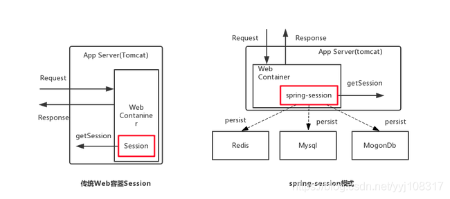
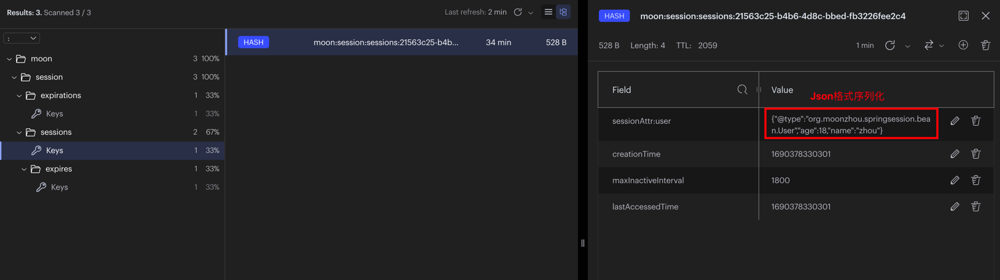
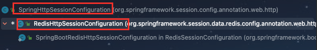

# spring session

## 背景
使用Java开发Web应用时，在单体应用时，使用HttpSession管理会话，HttpSession默认使用内存来管理Session。因此将应用横向扩展时，就会出现Session共享问题。针对这类问题，最原始的方案：
1. session复制（web容器实现，比如Tomcat支持 Session 集群，可在各 Tomcat 服务器间复制全部 session 信息），但也存在信息冗余，大对象复制慢等问题。
2. hash（sessionId）使其落到固定的机器上，问题是集群里的机器数目发生变化时，可能就会导致用户访问的机器发生变化，而变化的机器上没有相关session。

所以为了更符合分布式场景下的session管理，存储session的地方就不能时应用服务的内存，必须使用类似redis的独立存储中间件。同时实现将session在中间件中操作（继承重构`HttpServletRequestWrapper`,`HttpSessionWrapper`类,覆盖原来和session存取相关的方法）。



## 是什么？
`Spring Session` 是 `spring` 旗下的一个项目，把 `servlet` 容器实现的 `httpSession` 替换为 `springSession`，专注于解决`Servlet HttpSession`管理问题。同时session存储支持多种方式，以实现分布式系统中依然使用。


## 使用
### 引入依赖
```
<dependencies>
    <!--redis 依赖-->
    <dependency>
        <groupId>org.springframework.boot</groupId>
        <artifactId>spring-boot-starter-data-redis</artifactId>
    </dependency>
    <!--sessions 依赖-->
    <dependency>
        <groupId>org.springframework.session</groupId>
        <artifactId>spring-session-data-redis</artifactId>
    </dependency>
</dependencies>
```

### 添加配置
```
server:
  port: 8080
spring:
  session: # 设置session存储类型
    store-type: redis
  redis: # 配置redis
    port: 6379
    host: localhost
    database: 0
```

### 添加注解
```
@EnableRedisHttpSession(maxInactiveIntervalInSeconds = 1800, redisNamespace = "moon:session")
```

### 序列化
Spring-Session 默认使用 JDK 序列化机制，要求类实现 Serializable 接口，序列化后是二进制字节数组，不易看懂。使用 JSON 序列化机制，序列化后的字符串容易看懂。(存储在redis中的值)
示例中直接使用了fastjson的json格式序列化方法。**当然，不配置序列化也可以，在某种程度上，默认的序列化方式也有一定的混淆作用，在数据安全上有一定的作用。**
```
org.moonzhou.springsession.config.SessionConfig
```



### 测试
```
org.moonzhou.springsession.controller.SessionController
```

### 其他一些配置
```
# 设置 Spring Session 的过期时间。如果不指定单位模式是 s。 功能同 @EnableRedisHttpSession(maxInactiveIntervalInSeconds = 1800, redisNamespace = "moon:session")
spring.session.timeout=10m
# 存储 Session的命名空间(前缀)，默认是spring:session。
spring.session.redis.namespace=moon:session

# 将session 中的数据同步到redis 中提供了两种模式, 一种是当响应结束后同步, 另一种种是实时同步, 默认时第一种（on_save）.
# ON_SAVE: 只有当SessionRepository.save(Session)方法被调用时,才会将session中的数据同步到redis中. 在web 应用中, 当请求完成响应后, 才开始同步. 也就是说在执行response之前session数据都是缓存在本地的.(类似批量操作)
# IMMEDIATE: 实时同步session 数据到redis. 当执行SessionRepository.createSession()时, 会将session数据同步到redis中;当对session的attribute进行set/remove 等操作时, 也会同步session中的数据到redis中.
# 测试方法可以在操作session返回时（即controller方法return那一行），打上断点进行debug
spring.session.redis.flush-mode=on_save
```

## 底层实现
### 存储数据结构
```
> keys *
1) "moon:session:expirations:1690380180000"
2) "moon:session:sessions:21563c25-b4b6-4d8c-bbed-fb3226fee2c4"
3) "moon:session:sessions:expires:21563c25-b4b6-4d8c-bbed-fb3226fee2c4"

> smembers moon:session:expirations:1690380180000
1) "\"expires:21563c25-b4b6-4d8c-bbed-fb3226fee2c4\""

> hmget moon:session:sessions:21563c25-b4b6-4d8c-bbed-fb3226fee2c4 sessionAttr:user creationTime maxInactiveInterval lastAccessedTime
1) "{\"@type\":\"org.moonzhou.springsession.bean.User\",\"age\":18,\"name\":\"zhou\"}"
2) "1690378330301"
3) "1800"
4) "1690378330301"

> get moon:session:sessions:expires:21563c25-b4b6-4d8c-bbed-fb3226fee2c4
""
```

```
> MULTI
"OK"

> ttl moon:session:expirations:1690380180000
"QUEUED"

> ttl moon:session:sessions:21563c25-b4b6-4d8c-bbed-fb3226fee2c4
"QUEUED"

> ttl moon:session:sessions:expires:21563c25-b4b6-4d8c-bbed-fb3226fee2c4
"QUEUED"

> EXEC
1) "547"
2) "547"
3) "247"
```

1. 第一个key`moon:session:expirations:`：`Set` 类型的 Redis 数据结构，存储的值sessionId。key后面的时间戳，根据这个 Session 过期时刻滚动至后5分钟而计算得出(看其他博文有出现过1分钟的情况，此情况对应的spring-session版本为2.6.2)。
2. 第一个key`moon:session:sessions:`：`Hash` 类型的 Redis 数据结构，存储值为session的信息，包括 Session 的最近访问时间（lastAccessedTime）、过期时间间隔（maxInactiveInterval，默认是 30 分钟，这里保存的秒值）、创建时间（creationTime）、sessionAttr 等等。
3. 第三个key`moon:session:sessions:expires:`：`String` 类型的 Redis 数据结构，不存储任何有用数据，只是为表示 Session 过期而设置。这个 key 在 Redis 中的过期时间即为 Session 的过期时间，即代码中配置的timeout。

### 源码细节（核心类）
```
EnableRedisHttpSession  // 注解
RedisHttpSessionConfiguration  // 加载redis 的配置类
RedisIndexedSessionRepository // spring session 中 redis的操作类
SpringHttpSessionConfiguration // 初始化 springsession过滤器的配置类
SessionRepositoryFilter  // spring session 的过滤器，在这里获取session 创建session 保存session
CookieHttpSessionIdResolver  // cookie 转化成sessionId的转化器
SessionRepositoryRequestWrapper // 重写了request的getsession方法,重写之后会从redis中获取
```

#### EnableRedisHttpSession
```
@Retention(RetentionPolicy.RUNTIME)
@Target(ElementType.TYPE)
@Documented
@Import(RedisHttpSessionConfiguration.class) //首先要引入这个redissession的配置类
@Configuration(proxyBeanMethods = false)
public @interface EnableRedisHttpSession {

	/**
	 * The session timeout in seconds. By default, it is set to 1800 seconds (30 minutes).
	 * This should be a non-negative integer.
	 * @return the seconds a session can be inactive before expiring
	 */
	 //session 在redis中的失效时间
	int maxInactiveIntervalInSeconds() default MapSession.DEFAULT_MAX_INACTIVE_INTERVAL_SECONDS;

	/**
	 * Defines a unique namespace for keys. The value is used to isolate sessions by
	 * changing the prefix from default {@code spring:session:} to
	 * {@code <redisNamespace>:}.
	 * <p>
	 * For example, if you had an application named "Application A" that needed to keep
	 * the sessions isolated from "Application B" you could set two different values for
	 * the applications and they could function within the same Redis instance.
	 * @return the unique namespace for keys
	 */
	 //在redis中的前缀名称
	String redisNamespace() default RedisIndexedSessionRepository.DEFAULT_NAMESPACE;

	/**
	 * Flush mode for the Redis sessions. The default is {@code ON_SAVE} which only
	 * updates the backing Redis when {@link SessionRepository#save(Session)} is invoked.
	 * In a web environment this happens just before the HTTP response is committed.
	 * <p>
	 * Setting the value to {@code IMMEDIATE} will ensure that the any updates to the
	 * Session are immediately written to the Redis instance.
	 * @return the {@link RedisFlushMode} to use
	 * @since 1.1
	 * @deprecated since 2.2.0 in favor of {@link #flushMode()}
	 */
	@Deprecated
	RedisFlushMode redisFlushMode() default RedisFlushMode.ON_SAVE;
```
除了spring session相关的配置之外，其引入了`RedisHttpSessionConfiguration`。

#### RedisHttpSessionConfiguration
redis相关配置
```
// sessionRepository主要就是 session 保存在redis中的保存期
@Bean
public RedisIndexedSessionRepository sessionRepository() {
    RedisTemplate<Object, Object> redisTemplate = createRedisTemplate();
    RedisIndexedSessionRepository sessionRepository = new RedisIndexedSessionRepository(redisTemplate);
    sessionRepository.setApplicationEventPublisher(this.applicationEventPublisher);
    if (this.indexResolver != null) {
        sessionRepository.setIndexResolver(this.indexResolver);
    }
    if (this.defaultRedisSerializer != null) {
        sessionRepository.setDefaultSerializer(this.defaultRedisSerializer);
    }
    sessionRepository.setDefaultMaxInactiveInterval(this.maxInactiveIntervalInSeconds);
    if (StringUtils.hasText(this.redisNamespace)) {
        sessionRepository.setRedisKeyNamespace(this.redisNamespace);
    }
    sessionRepository.setFlushMode(this.flushMode);
    sessionRepository.setSaveMode(this.saveMode);
    int database = resolveDatabase();
    sessionRepository.setDatabase(database);
    this.sessionRepositoryCustomizers
            .forEach((sessionRepositoryCustomizer) -> sessionRepositoryCustomizer.customize(sessionRepository));
    return sessionRepository;
}

// redis 的监听器，一般监听的是 session在redis中删除或者是到达了失效时间
@Bean
public RedisMessageListenerContainer springSessionRedisMessageListenerContainer(
        RedisIndexedSessionRepository sessionRepository) {
    RedisMessageListenerContainer container = new RedisMessageListenerContainer();
    container.setConnectionFactory(this.redisConnectionFactory);
    if (this.redisTaskExecutor != null) {
        container.setTaskExecutor(this.redisTaskExecutor);
    }
    if (this.redisSubscriptionExecutor != null) {
        container.setSubscriptionExecutor(this.redisSubscriptionExecutor);
    }
    container.addMessageListener(sessionRepository,
            Arrays.asList(new ChannelTopic(sessionRepository.getSessionDeletedChannel()),
                    new ChannelTopic(sessionRepository.getSessionExpiredChannel())));
    container.addMessageListener(sessionRepository,
            Collections.singletonList(new PatternTopic(sessionRepository.getSessionCreatedChannelPrefix() + "*")));
    return container;
}
```
其继承了`HttpSessionConfiguration-architecture`，初始化`RedisIndexedSessionRepository`的bean对象。



#### RedisIndexedSessionRepository
redis相关的操作：
- 保存session
- 通过sessionId获取session
```
@Override
public void save(RedisSession session) {
    session.save();
    if (session.isNew) {
        String sessionCreatedKey = getSessionCreatedChannel(session.getId());
        this.sessionRedisOperations.convertAndSend(sessionCreatedKey, session.delta);
        session.isNew = false;
    }
}

public void cleanupExpiredSessions() {
    this.expirationPolicy.cleanExpiredSessions();
}

@Override
public RedisSession findById(String id) {
    return getSession(id, false);
}

// session内容
private MapSession loadSession(String id, Map<Object, Object> entries) {
    MapSession loaded = new MapSession(id);
    Iterator var4 = entries.entrySet().iterator();

    while(var4.hasNext()) {
        Map.Entry<Object, Object> entry = (Map.Entry)var4.next();
        String key = (String)entry.getKey();
        if ("creationTime".equals(key)) {
            loaded.setCreationTime(Instant.ofEpochMilli((Long)entry.getValue()));
        } else if ("maxInactiveInterval".equals(key)) {
            loaded.setMaxInactiveInterval(Duration.ofSeconds((long)(Integer)entry.getValue()));
        } else if ("lastAccessedTime".equals(key)) {
            loaded.setLastAccessedTime(Instant.ofEpochMilli((Long)entry.getValue()));
        } else if (key.startsWith("sessionAttr:")) {
            loaded.setAttribute(key.substring("sessionAttr:".length()), entry.getValue());
        }
    }

    return loaded;
}
```

#### SpringHttpSessionConfiguration
```
private CookieHttpSessionIdResolver defaultHttpSessionIdResolver = new CookieHttpSessionIdResolver();
private HttpSessionIdResolver httpSessionIdResolver;

public SpringHttpSessionConfiguration() {
    this.httpSessionIdResolver = this.defaultHttpSessionIdResolver;
    this.httpSessionListeners = new ArrayList();
}

@Bean
public <S extends Session> SessionRepositoryFilter<? extends Session> springSessionRepositoryFilter(
        SessionRepository<S> sessionRepository) {
    SessionRepositoryFilter<S> sessionRepositoryFilter = new SessionRepositoryFilter<>(sessionRepository);
    sessionRepositoryFilter.setHttpSessionIdResolver(this.httpSessionIdResolver); //sessionId转化器，为CookieHttpSessionIdResolver的实例化对象
    return sessionRepositoryFilter;
}
```

核心：
- 配置sessionId转化器为`CookieHttpSessionIdResolver`。
- 初始化`SessionRepositoryFilter`过滤器，该核心拦截器会先拦截到请求，将 `request` 和 `response` 对象转换成 `SessionRepositoryRequestWrapper` `和SessionRepositoryResponseWrapper` 。 后续当第一次调用 `request` 的 `getSession` 方法时，会调用到 `SessionRepositoryRequestWrapper` 的 `getSession` 方法。

#### CookieHttpSessionIdResolver
```
private CookieSerializer cookieSerializer = new DefaultCookieSerializer();

//通过cookie获取sessionId
@Override
public List<String> resolveSessionIds(HttpServletRequest request) {
    return this.cookieSerializer.readCookieValues(request);
}

// 将sessionId 写回cookie中
@Override
public void setSessionId(HttpServletRequest request, HttpServletResponse response, String sessionId) {
    if (sessionId.equals(request.getAttribute(WRITTEN_SESSION_ID_ATTR))) {
        return;
    }
    request.setAttribute(WRITTEN_SESSION_ID_ATTR, sessionId);
    this.cookieSerializer.writeCookieValue(new CookieValue(request, response, sessionId));
}
```
封装操作cookie的方法，具体的操作还是通过`DefaultCookieSerializer`。

#### DefaultCookieSerializer
```
private boolean useBase64Encoding = true;

// 具体的方法获取sessionId
@Override
public List<String> readCookieValues(HttpServletRequest request) {
    Cookie[] cookies = request.getCookies();
    List<String> matchingCookieValues = new ArrayList<>();
    if (cookies != null) {
        for (Cookie cookie : cookies) {
            if (this.cookieName.equals(cookie.getName())) {
                String sessionId = (this.useBase64Encoding ? base64Decode(cookie.getValue()) : cookie.getValue());
                if (sessionId == null) {
                    continue;
                }
                if (this.jvmRoute != null && sessionId.endsWith(this.jvmRoute)) {
                    sessionId = sessionId.substring(0, sessionId.length() - this.jvmRoute.length());
                }
                matchingCookieValues.add(sessionId);
            }
        }
    }
    return matchingCookieValues;
}

public void writeCookieValue(CookieSerializer.CookieValue cookieValue) {
    HttpServletRequest request = cookieValue.getRequest();
    HttpServletResponse response = cookieValue.getResponse();
    StringBuilder sb = new StringBuilder();
    sb.append(this.cookieName).append('=');
    String value = this.getValue(cookieValue);
    if (value != null && value.length() > 0) {
        this.validateValue(value);
        sb.append(value);
    }

    int maxAge = this.getMaxAge(cookieValue);
    if (maxAge > -1) {
        sb.append("; Max-Age=").append(cookieValue.getCookieMaxAge());
        ZonedDateTime expires = maxAge != 0 ? ZonedDateTime.now(this.clock).plusSeconds((long)maxAge) : Instant.EPOCH.atZone(ZoneOffset.UTC);
        sb.append("; Expires=").append(expires.format(DateTimeFormatter.RFC_1123_DATE_TIME));
    }

    String domain = this.getDomainName(request);
    if (domain != null && domain.length() > 0) {
        this.validateDomain(domain);
        sb.append("; Domain=").append(domain);
    }

    String path = this.getCookiePath(request);
    if (path != null && path.length() > 0) {
        this.validatePath(path);
        sb.append("; Path=").append(path);
    }

    if (this.isSecureCookie(request)) {
        sb.append("; Secure");
    }

    if (this.useHttpOnlyCookie) {
        sb.append("; HttpOnly");
    }

    if (this.sameSite != null) {
        sb.append("; SameSite=").append(this.sameSite);
    }

    response.addHeader("Set-Cookie", sb.toString());
}

private String getValue(CookieSerializer.CookieValue cookieValue) {
    String requestedCookieValue = cookieValue.getCookieValue();
    String actualCookieValue = requestedCookieValue;
    if (this.jvmRoute != null) {
        actualCookieValue = requestedCookieValue + this.jvmRoute;
    }

    if (this.useBase64Encoding) {
        actualCookieValue = this.base64Encode(actualCookieValue);
    }

    return actualCookieValue;
}
```
SpringSession提供了两种保存和传递SessionId的方式，一种是基于Cookie的，一种是基于Header的。SpringSession中默认使用的是基于Cookie的方式。readCookieValues 就是实现如何从Cookie中获取sessionId的。
从request中获取当前请求携带的所以的Cookie信息，然后将匹配到的 cookieName 为 “SESSION” 的Cookie进行解析。需要注意的是sessionId的存储和获取方法需要将cookie中的value进行base64编码和解码。

#### SessionRepositoryFilter(核心)
```
@Order(SessionRepositoryFilter.DEFAULT_ORDER)
public class SessionRepositoryFilter<S extends Session> extends OncePerRequestFilter {

	private static final String SESSION_LOGGER_NAME = SessionRepositoryFilter.class.getName().concat(".SESSION_LOGGER");

	private static final Log SESSION_LOGGER = LogFactory.getLog(SESSION_LOGGER_NAME);

	/**
	 * The session repository request attribute name.
	 */
	public static final String SESSION_REPOSITORY_ATTR = SessionRepository.class.getName();

	/**
	 * Invalid session id (not backed by the session repository) request attribute name.
	 */
	public static final String INVALID_SESSION_ID_ATTR = SESSION_REPOSITORY_ATTR + ".invalidSessionId";

	private static final String CURRENT_SESSION_ATTR = SESSION_REPOSITORY_ATTR + ".CURRENT_SESSION";

	/**
	 * The default filter order.
	 */
	public static final int DEFAULT_ORDER = Integer.MIN_VALUE + 50;

	private final SessionRepository<S> sessionRepository;

	private HttpSessionIdResolver httpSessionIdResolver = new CookieHttpSessionIdResolver();

	/**
	 * Creates a new instance.
	 * @param sessionRepository the <code>SessionRepository</code> to use. Cannot be null.
	 */
	public SessionRepositoryFilter(SessionRepository<S> sessionRepository) {
		if (sessionRepository == null) {
			throw new IllegalArgumentException("sessionRepository cannot be null");
		}
		this.sessionRepository = sessionRepository;
	}

	/**
	 * Sets the {@link HttpSessionIdResolver} to be used. The default is a
	 * {@link CookieHttpSessionIdResolver}.
	 * @param httpSessionIdResolver the {@link HttpSessionIdResolver} to use. Cannot be
	 * null.
	 */
	public void setHttpSessionIdResolver(HttpSessionIdResolver httpSessionIdResolver) {
		if (httpSessionIdResolver == null) {
			throw new IllegalArgumentException("httpSessionIdResolver cannot be null");
		}
		this.httpSessionIdResolver = httpSessionIdResolver;
	}


    // 过滤器真正执行逻辑的方法
	@Override
	protected void doFilterInternal(HttpServletRequest request, HttpServletResponse response, FilterChain filterChain)
			throws ServletException, IOException {
		request.setAttribute(SESSION_REPOSITORY_ATTR, this.sessionRepository);

		SessionRepositoryRequestWrapper wrappedRequest = new SessionRepositoryRequestWrapper(request, response);
		SessionRepositoryResponseWrapper wrappedResponse = new SessionRepositoryResponseWrapper(wrappedRequest, response);

		try {
			filterChain.doFilter(wrappedRequest, wrappedResponse);
		} finally {
		    // 在这个方法中会将session保存在redis中
			wrappedRequest.commitSession();
		}
	}
}
```
在filter里，通过order（Integer.MIN_VALUE + 50，越小优先级越高），保证其在Filter链中执行较靠前，返回较靠后（责任链）。从而保证session的操作管理能涵盖更大范围。
核心为重写request和response。保证后续request和response操作都是基于此重写的方法。

#### SessionRepositoryRequestWrapper
```
private final class SessionRepositoryRequestWrapper extends HttpServletRequestWrapper {

    private final HttpServletResponse response;

    private S requestedSession;

    private boolean requestedSessionCached;

    private String requestedSessionId;

    private Boolean requestedSessionIdValid;

    private boolean requestedSessionInvalidated;

    private SessionRepositoryRequestWrapper(HttpServletRequest request, HttpServletResponse response) {
        super(request);
        this.response = response;
    }

    /**
     * Uses the {@link HttpSessionIdResolver} to write the session id to the response
     * and persist the Session.
     */
    // 保存session进redis中，设置超时时间
    private void commitSession() {
        HttpSessionWrapper wrappedSession = getCurrentSession();
        if (wrappedSession == null) {
            if (isInvalidateClientSession()) {
                SessionRepositoryFilter.this.httpSessionIdResolver.expireSession(this, this.response);
            }
        }
        else {
            S session = wrappedSession.getSession();
            clearRequestedSessionCache();
            // 保存进redis(底层设置值时有设置超时时间)
            SessionRepositoryFilter.this.sessionRepository.save(session);
            String sessionId = session.getId();
            if (!isRequestedSessionIdValid() || !sessionId.equals(getRequestedSessionId())) {
                // 将session 写入cookie
                SessionRepositoryFilter.this.httpSessionIdResolver.setSessionId(this, this.response, sessionId);
            }
        }
    }
    
    
    // 从request中获取当前的session,这样再一次请求中不会每次都去redis中查找session
    private HttpSessionWrapper getCurrentSession() {
        return (HttpSessionWrapper) getAttribute(CURRENT_SESSION_ATTR);
    }

    private void setCurrentSession(HttpSessionWrapper currentSession) {
        if (currentSession == null) {
            removeAttribute(CURRENT_SESSION_ATTR);
        }
        else {
            setAttribute(CURRENT_SESSION_ATTR, currentSession);
        }
    }
    
    // 获取session 特别重要！！！！！
    @Override
    public HttpSessionWrapper getSession(boolean create) {
        // 首先 request中获取 当前session,没有的话从redis中获取
        HttpSessionWrapper currentSession = getCurrentSession();
        if (currentSession != null) {
            return currentSession;
        }
        // 这个方法就是讲cookie转化成sessionId之后从redis中获取session,具体代码在下面（该方法有缓存，同一次请求http请求中，如果多次调用getSession方法，除了第一次，后续直接获取值）
        S requestedSession = getRequestedSession();
        // redis中如果有域名直接返回  一般第二次的请求都是走到这里就结束了，从redis中获取session
        if (requestedSession != null) {
            if (getAttribute(INVALID_SESSION_ID_ATTR) == null) {
                requestedSession.setLastAccessedTime(Instant.now());
                this.requestedSessionIdValid = true;
                currentSession = new HttpSessionWrapper(requestedSession, getServletContext());
                currentSession.markNotNew();
                setCurrentSession(currentSession);
                return currentSession;
            }
        }
        else {
            // This is an invalid session id. No need to ask again if
            // request.getSession is invoked for the duration of this request
            if (SESSION_LOGGER.isDebugEnabled()) {
                SESSION_LOGGER.debug(
                        "No session found by id: Caching result for getSession(false) for this HttpServletRequest.");
            }
            setAttribute(INVALID_SESSION_ID_ATTR, "true");
        }
        // 获取session的时候会带上是否创建create标识
        if (!create) {
            return null;
        }
        if (SessionRepositoryFilter.this.httpSessionIdResolver instanceof CookieHttpSessionIdResolver
                && this.response.isCommitted()) {
            throw new IllegalStateException("Cannot create a session after the response has been committed");
        }
        if (SESSION_LOGGER.isDebugEnabled()) {
            SESSION_LOGGER.debug(
                    "A new session was created. To help you troubleshoot where the session was created we provided a StackTrace (this is not an error). You can prevent this from appearing by disabling DEBUG logging for "
                            + SESSION_LOGGER_NAME,
                    new RuntimeException("For debugging purposes only (not an error)"));
        }
        // 创建redis session
        S session = SessionRepositoryFilter.this.sessionRepository.createSession();
        session.setLastAccessedTime(Instant.now());
        currentSession = new HttpSessionWrapper(session, getServletContext());
        // 将新创建的session放入request的当前session中
        setCurrentSession(currentSession);
        return currentSession;
    }
    
    
    // 上面的从redis中获取session 的方法 首先通过 sessionId转换器将cookie转换成sessionId 之后再redis中找找
    private S getRequestedSession() {
        if (!this.requestedSessionCached) {
            List<String> sessionIds = SessionRepositoryFilter.this.httpSessionIdResolver.resolveSessionIds(this);
            for (String sessionId : sessionIds) {
                if (this.requestedSessionId == null) {
                    this.requestedSessionId = sessionId;
                }
                S session = SessionRepositoryFilter.this.sessionRepository.findById(sessionId);
                if (session != null) {
                    this.requestedSession = session;
                    this.requestedSessionId = sessionId;
                    break;
                }
            }
            this.requestedSessionCached = true;
        }
        return this.requestedSession;
    }
}
```

#### OnCommittedResponseWrapper & SessionRepositoryResponseWrapper

### 总结
Spring-Session的实现就是设计一个过滤器 `SessionRepositoryFilter`，`SessionRepositoryFilter` 会先拦截到请求，将 request 和 response 对象转换成 `SessionRepositoryRequestWrapper` 和 `SessionRepositoryResponseWrapper` 。
后续当第一次调用 request 的getSession方法时，会调用到 `SessionRepositoryRequestWrapper` 的 `getSession` 方法。

如果从request中的属性中查找不到session，再通过cookie拿到sessionid去redis中查找，如果差查不到，就直接创建一个redis session对象，并同步到redis中。
将创建销毁session的过程从服务器转移到redis中去。

#### 注意点
1. 在filter里，通过order（Integer.MIN_VALUE + 50，越小优先级越高），保证其在Filter链中执行较靠前，返回较靠后（责任链）。从而保证session的操作管理能涵盖更大范围。
2. 后续如果想增强 request 和 response，需要考虑Filter是在该Filter之前还是之后执行，如果之后执行，切记增强的 request 和 response 对应的包装类需要继承 `SessionRepositoryRequestWrapper` 和 `SessionRepositoryResponseWrapper`。
3. 集成了`OncePerRequestFilter`，确保在一次请求只通过一次filter，而不需要重复执行。（服务端重定向时，没必要再进一次该Filter）
4. `@EnableRedisHttpSession`的优先级是高于yml中`spring.session`的配置，即使用时二选一，如果不区分环境，使用注解，如果区分环境，则使用yml中`spring.session`配置。

#### 缺陷
1. 无法做到 Session 的过期以及销毁事件的实时发布(redis的惰性删除，如果长时间无访问或者无操作spring session，session即使过期了也不会删除)
2. 序列化方式可能对一些特定类型的会话，支持的不是很好
3. Redis 存储一个会话需要 3 个 键值，占用空间稍微大些
4. 在高并发场景下，Session 因为不是 CAS(Compare And Set) 操作，所以可能存在一些并发问题（小问题）

#### 规范（上升维度）
JSR340是Java Servlet 3.1的规范提案，其中定义了大量的api，
包括：servlet、servletRequest/HttpServletRequest/HttpServletRequestWrapper、servletResponse/HttpServletResponse/HttpServletResponseWrapper、Filter、Session等，
是标准的web容器需要遵循的规约，如tomcat/jetty/weblogic等等。

Servlet规范中定义一系列的接口都是支持扩展，同时提供Filter支撑扩展点。建议阅读**《JavaTM Servlet Specification》**。

## 参考
1. [SpringSession系列-集成SpringBoot](https://juejin.cn/post/6844903703921557517)
2. [Spring Session 的两种刷新模式-RedisFlushMode](https://blog.csdn.net/cristianoxm/article/details/120764550)
3. [SpringBoot 整合 Spring-Session 实现分布式会话（实战篇）](https://blog.csdn.net/piaoranyuji/article/details/125865704)
4. [白话 spring session 源码](https://juejin.cn/post/6969748105285599246)
5. [SpringBoot集成SpringSession](https://blog.csdn.net/yyj108317/article/details/108752349)