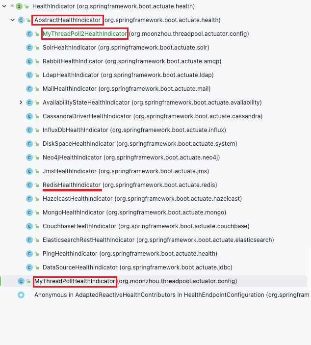
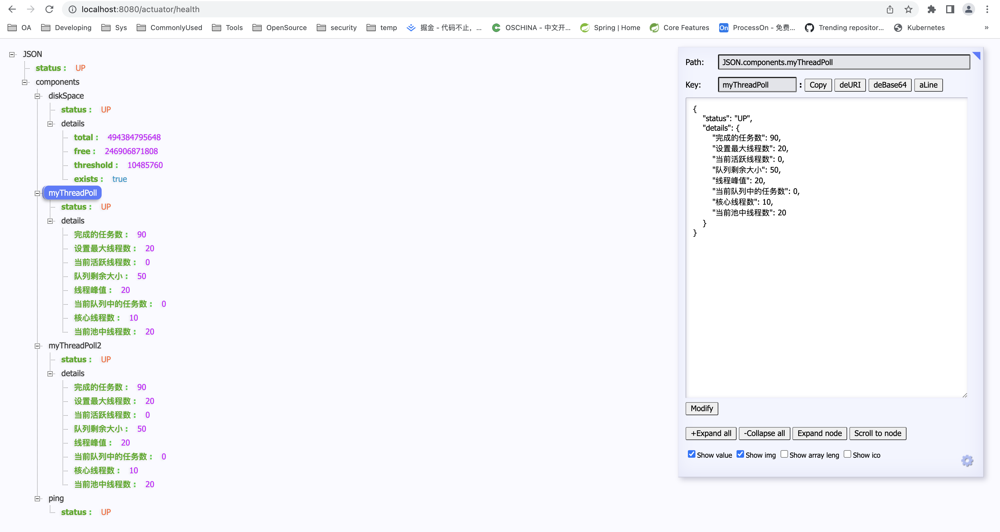

# springboot threadpool monitor by actuator

## 背景
无论是分布式的系统还是传统单体应用，或多或少都会有一些异步或者提高执行效率的场景或要求。最常见的处理方式就是使用多线程进行并发处理。

多线程在使用过程中，为了安全，更多是通过线程池的方式进行使用。
虽然能提高程序执行的效率，但如果配置不合理或者在问题发生时，不能及时发现并处理，也很容易造成服务异常停止，无法使用的情况。
因此，最好能够实时监控线程的使用，更进一步，就是能够动态调整线程的参数了。

此文使用比较简单的方式，通过`Spring Boot Actuator`来进行线程池的监控。

## 使用Actuator
1. 添加依赖
   ```
   <dependency>
       <groupId>org.springframework.boot</groupId>
       <artifactId>spring-boot-starter-actuator</artifactId>
   </dependency>
   ```
2. 配置端点
    ```
    management:
      endpoints:
        web:
          exposure:
            include: "*" # 开启所有的端点
      endpoint:
        health:
          show-details: always # 开启健康监控数据
    ```
3. 访问验证：http://localhost:8080/actuator/health

## 配置线程池监控
1. 配置线程池：`org.moonzhou.threadpool.actuator.config.ThreadPoolConfig`
2. 自定义`Indicator`，实现`HealthIndicator`接口：`org.moonzhou.threadpool.actuator.config.MyThreadPollHealthIndicator`
3. 自定义的`Indicator`，直接添加`@Component`，就可以通过`http://localhost:8080/actuator/health`看到监控的数据。也可以不加`@Component`，通过实现`CompositeHealthContributor`的方式：`org/moonzhou/threadpool/actuator/config/MyCompositeHealthContributor.java:16`
4. 或者实现`AbstractHealthIndicator`：`org.moonzhou.threadpool.actuator.config.MyThreadPoll2HealthIndicator`

从`spring`总体架构设计来看，更推荐使用实现`AbstractHealthIndicator`抽象类的方式，因为抽象类中封装了接口，基于接口定义了模板逻辑（模板方法）。同时`spring`自己实现了很多健康监控逻辑也是基于实现`AbstractHealthIndicator`抽象类的方式，比如：`org.springframework.boot.actuate.redis.RedisHealthIndicator`等。

## 测试
1. 测试代码：`org.moonzhou.threadpool.actuator.controller.ThreadPoolActuatorController.runBiz`，访问路径为：`http://localhost:8080/threadpool-actuator/run-biz`
2. 查看信息：http://localhost:8080/actuator/health
3. 多线程可使用jmeter进行测试，测试文件：`spring-boot-threadpool-actuator/file/thread pool actuator monitor.jmx`


## 其他
### `@PostConstruct`
- `Java`的注解
- 初始化操作，但初始化可能依赖于注入的其他组件，要等依赖全部加载完再执行
- 被用来修饰一个非静态的 `void()` 方法，被修饰的方法会在服务器加载Servlet的时候运行，并且只会被服务器执行一次
- 在一个bean的初始化过程中，方法执行先后顺序为 `Constructor > @Autowired > @PostConstruct`。先执行完构造方法，再注入依赖，最后执行初始化操作。

```java
import org.springframework.beans.factory.annotation.Autowired;
import org.springframework.data.redis.core.RedisTemplate;
import org.springframework.stereotype.Component;

import javax.annotation.PostConstruct;

@Component
public class RedisUtil {

    private static RedisTemplate<Object, Object> staticRedisTemplates;

    // 也可以使用构造方法注入
    @Autowired
    private RedisTemplate<Object, Object> redisTemplate;

    @PostConstruct
    public void initialize() {
        staticRedisTemplates = this.redisTemplate;
    }

    public static void set(Object key, Object value) {

        staticRedisTemplates.opsForValue().set(key, value);
    }
}
```

## 参考
1. [Spring Boot Actuator 监控线程池](https://blog.csdn.net/a20023930/article/details/110918477)