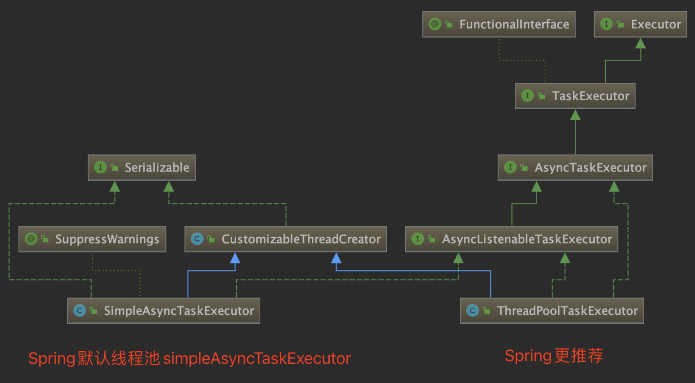
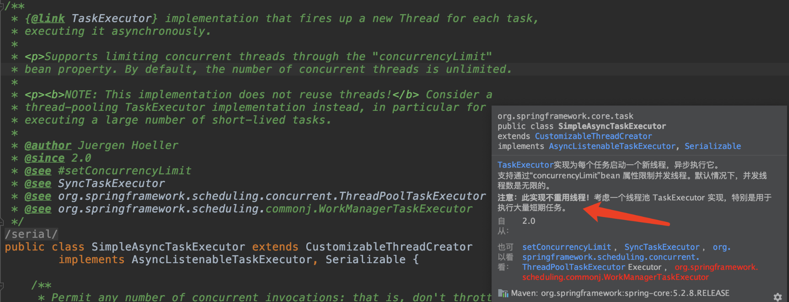

## springboot thread pool

### 背景
在业务完成某一功能之后，往往需要通知相关系统，同步一些数据，而相关同步操作不需要实时关注结果。比如登录场景下，登录完成之后，需要同步登录信息给风控系统，用于用户登录模型的计算；
比如用户注册之后，需要短信通知用户注册成功信息；比如用户注册之后，还会给用户发送营销券并进行短信通知等。

而在最近，业务系统需要完成审批以及会签等流程操作，因而系统集成了工作量引擎。但是在公司层面，有一个通用的流程中心，但是因为各种原因不支持会签等功能，
也不打算支持，所以我们业务系统集成了工作流来满足业务需求。而需求又想在公司通用流程里面，把我们流程集成进去，通过公共流程中心也能对我们的流程进行审批。

因此决定在我们完成相关审批操作后，把相关数据同步给公共流程中心，以完成这一功能。而同步数据本身是不能够影响业务本身的（同步失败应该通过补偿方案来进行补偿），
因此为了业务提高业务接口本身的吞吐量，可以将这部分业务进行异步化。

### 使用方式
在没有spring的情况下，需要通过JDK相关方法来进行线程池的创建。虽然通过 `java.util.concurrent.Executors` 可以创建线程池，但是容易产生 `OOM`，
需要手动使用ThreadPoolExecutor创建线程池（自定义好参数）。在springboot中使用步骤如下：
1. 添加线程池配置：核心线程池参数配置
2. 初始化线程池实例：实例化`ThreadPoolTaskExecutor`（底层还是`ThreadPoolExecutor`）
3. 初始化线程池：`@Configuration`
4. 启用异步：`@EnableAsync`
5. 服务上添加异步注解：`@Async`，可以指定使用的线程池。

### 线程池参数
- corePoolSize: 核心线程数，当向线程池提交一个任务时池里的线程数小于核心线程数，那么它会创建一个线程来执行这个任务，一直直到池内的线程数等于核心线程数
- maxPoolSize: 最大线程数，线程池中允许的最大线程数量。关于这两个数量的区别我会在下面解释
- queueCapacity: 缓冲队列大小，用来保存阻塞的任务队列（注意这里的队列放的是任务而不是线程）
- keepAliveSeconds: 允许线程存活时间（空闲状态下），单位为秒，默认60s
- namePrefix: 线程名前缀
- RejectedExecutionHandler: 拒绝策略，当线程池达到最大线程数时，如何处理新任务。线程池为我们提供的策略有
  - AbortPolicy：默认策略。直接抛出 RejectedExecutionException
  - DiscardPolicy：直接丢弃掉被拒绝的任务，且不会抛出任何异常
  - DiscardOldestPolicy：丢弃掉队列中的队头元素（也就是最早在队列里的任务），然后重新执行 提交该任务 的操作
  - CallerRunsPolicy：由主线程自己来执行这个任务，该机制将减慢新任务的提交

当向线程池提交任务时：
- 若 **当前运行的线程数 < corePoolSize**

  则 即使其它的工作线程处于空闲状态，线程池也会创建一个新线程来执行任务

- 若 **corePoolSize < 当前运行的线程数 < maxPoolSize**
  - 若 队列已满

    则 创建新线程来执行任务

  - 若 队列未满

    则 加入队列中

- 若 **当前运行的线程数 > maxPoolSize**
  - 若 队列已满

    则 拒绝任务

  - 若 队列未满

    则 加入队列中

所以当想要创建固定大小的线程池时，将 corePoolSize 和 maxPoolSize 设置成一样就行了。

### 异常处理
重写方法：`org.springframework.scheduling.annotation.AsyncConfigurerSupport.getAsyncUncaughtExceptionHandler`。

示例：`org.moonzhou.threadpool.config.AsyncConfiguration`

在无返回值的异步调用中，异步处理抛出异常，`AsyncExceptionHandler`的`getAsyncUncaughtExceptionHandler`会捕获指定异常，原有任务还会继续运行，直到结束。
捕获的异常与异步线程号一致，依然属于子线程。原有任务依然在主线程不受影响。示例入口：`org.moonzhou.threadpool.controller.ThreadPoolController.testException`

在有返回值的异步调用中，异步处理抛出异常，会直接抛出异常，异步任务结束，原有处理结束执行。`AsyncExceptionHandler`的`getAsyncUncaughtExceptionHandler`不会捕获到异常。
示例入口：`org.moonzhou.threadpool.controller.ThreadPoolController.testExceptionResult`

### 注意点
1. 自定义线程池名称时，注意命名规则，否则可能不会生效。
2. 使用线程池时注意**线程池的隔离**，避免并发请求高的场景，影响并发低的场景的业务执行。
3. 使用`ThreadPoolTaskExecutor`线程池，注意OOM情况：因为最大线程数为`Integer.MAX_VALUE`，同时拒绝策略为直接丢弃策略`AbortPolicy`。从最大线程数的角度而言，只会oom，不会触发拒绝策略。源码细节(spring 5.2.9)：
```
// ThreadPoolTaskExecutor

private int corePoolSize = 1;
private int maxPoolSize = Integer.MAX_VALUE;
private int keepAliveSeconds = 60;
private int queueCapacity = Integer.MAX_VALUE;
private boolean allowCoreThreadTimeOut = false;
private boolean prestartAllCoreThreads = false;

protected ExecutorService initializeExecutor(
        ThreadFactory threadFactory, RejectedExecutionHandler rejectedExecutionHandler) {

    BlockingQueue<Runnable> queue = createQueue(this.queueCapacity);

    ThreadPoolExecutor executor;
    if (this.taskDecorator != null) {
        executor = new ThreadPoolExecutor(
        this.corePoolSize, this.maxPoolSize, this.keepAliveSeconds, TimeUnit.SECONDS,
        queue, threadFactory, rejectedExecutionHandler) {
            @Override
            public void execute(Runnable command) {
                    Runnable decorated = taskDecorator.decorate(command);
                    if (decorated != command) {
                    decoratedTaskMap.put(decorated, command);
                    }
                    super.execute(decorated);
            }
        };
    } else {
        executor = new ThreadPoolExecutor(
        this.corePoolSize, this.maxPoolSize, this.keepAliveSeconds, TimeUnit.SECONDS,
        queue, threadFactory, rejectedExecutionHandler);

    }

    if (this.allowCoreThreadTimeOut) {
    executor.allowCoreThreadTimeOut(true);
    }
    if (this.prestartAllCoreThreads) {
    executor.prestartAllCoreThreads();
    }

    this.threadPoolExecutor = executor;
    return executor;
}
```

```
// ExecutorConfigurationSupport

private RejectedExecutionHandler rejectedExecutionHandler = new ThreadPoolExecutor.AbortPolicy();

public void initialize() {
    if (logger.isInfoEnabled()) {
        logger.info("Initializing ExecutorService" + (this.beanName != null ? " '" + this.beanName + "'" : ""));
    }
    if (!this.threadNamePrefixSet && this.beanName != null) {
        setThreadNamePrefix(this.beanName + "-");
    }
    this.executor = initializeExecutor(this.threadFactory, this.rejectedExecutionHandler);
}
```
4. `@Async`默认线程池`SimpleAsyncTaskExecutor`：不是真的线程池，这个类不重用线程，每次调用都会创建一个新的线程，没有最大线程数设置。并发大的时候会产生严重的性能问题。


5. 自定义线程池之后，使用自定义的线程池，即`@Async`必须明确线程池的`bean`，原有默认的线程池配置不生效，但是异步生效了（TODO: 分析源码）。同时有如下提示：
```
More than one TaskExecutor bean found within the context, and none is named 'taskExecutor'. Mark one of them as primary or name it 'taskExecutor' (possibly as an alias) in order to use it for async processing: [asyncTaskExecutor, asyncMessageExecutor]
```

### 测试接口
1. JMeter 压测http接口
2. postman 压测
3. JMH 接口压测（安装idea插件）


### 参考
1. [性能测试很简单-使用JMeter进行性能测试实践](https://zhuanlan.zhihu.com/p/369288617)
2. [Postman接口与压力测试实例](https://www.cnblogs.com/yinjia/p/10122178.html)
3. [压测 JMH/JMeter](https://www.cnblogs.com/ruhuanxingyun/p/14248315.html)
4. [Spring Boot中有多个@Async异步任务时，记得做好线程池的隔离！](https://juejin.cn/post/7009088674344206373)
