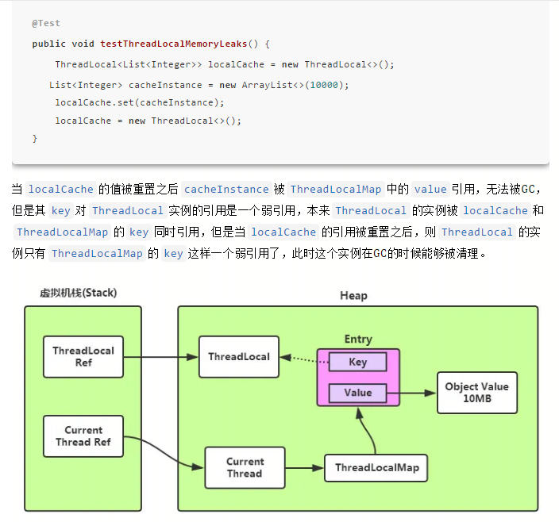

### 关于ThreadLocal在实际操作中使用的示例

#### 背景
> 基于CAS的单点登录系统，在某些平台（微信），会检测url可能存在的安全问题，如果发现，会封禁域名在微信里的访问。
>
> 因为passport是所有系统的门户系统，域名封禁会导致所有系统均不可使用，因此做了备份域名方案，封禁时切换备用域名。
>
> 而CAS的架构是client的jar包 + 服务系统（http+rpc接口），其中client的jar是接入方需要引入的，依据此jar进行302请求验证来进行ticket验证。也是据此来信任的。
> 
> 所以多域名支持时，为了减小影响范围，需要传入HttpServletRequest，通过其获取UA判断是否是微信环境。而很多方法里没有这个参数，需要从filter最上面一层层传递下去。
>
> 此方式不够优雅，后来学习强软弱虚四大引用时，说到了弱引用ThreadLocal，其中之一的使用方式是线程最开始设置值，线程后面使用时直接获取。不需要层层传递，实现优雅，让我们更关注业务逻辑的实现。
>
> 此示例应运而生。

#### 核心
1. client jar 是通过filter来实现的，即本身就是一个filter，接入的系统做好拦截的配置。如果没有登录状态，则拦截到登录页。
1. 拦截到登录的过程，就需要根据HttpServletRequest来判断UA，动态获取跳转登录地址（多域名）。
1. 原始很多获取域名的方法，是没有HttpServletRequest参数的，因此需要一层层从filter里往下传递。
1. 后来看到ThreadLocal可以优雅的实现这个需求，因此有了这个示例。
    * GlobalConstant.CURRENT_THREAD_REQUEST效果不够明显(需要看引用值)
    * GlobalConstant.LOG效果明显(直接看id值)

#### 注意点
1. 为了便于测试，体现tomcat线程池，ThreadLocal为各个线程的本地变量，因此手动修改了该项目的`application.yml`里关于容器的线程池大小，修改为3。
2. 因为ThreadLocal为线程本地变量，而整个web容器（tomcat）启动后，也使用到了ThreadLocal，所以线程池的各个线程的`ThreadLocal.ThreadLocalMap threadLocals`属性必然不为空，即`Thread.getMap`必然不为空，但是此Map不为空，key为当前ThreadLocal的实例地址，因为当前的ThreadLocal实例还未进行过任何set，所以必然get不到任何值。
1. 如果多次请求是同一个线程进行处理，则第一次进行处理时，ThreadLocal实例的get方法为空，随即就进行过set，所以后续的线程进行处理时，实例的get方法就不为空了。
    ```java
    // 即下面的方法在第一个请求到达时，获取不到值，后续相同的线程则可以获取到。但是如果后续的线程是另一个线程，而该线程之前未访问过，则还是获取不到值。
    // 总共三个线程：线程1，线程2，线程3
    // 第一个请求：线程1处理，第一次访问，get为null
    // 第二个请求：线程1处理，第二次访问，get有值，后续get都有值
    // 第三个请求：线程2处理，第一次访问（因为前面未使用线程2进行过处理），get为null
    // 第四个请求：线程3处理，第一次访问（因为前面未使用线程3进行过处理），get为null
    // 第五个请求：线程2处理，第二次访问（因为前面使用线程2进行过处理），get有值，且后面都有值
    // 第六个请求：线程3处理，第二次访问（因为前面使用线程3进行过处理），get有值，且后面都有值
    GlobalConstant.CURRENT_THREAD_REQUEST.get();
    
    GlobalConstant.CURRENT_THREAD_REQUEST.set(servletRequest);
    ```
1. 因为request的生命周期为每一次请求，所以get出来，虽然实例的引用存在，但是其值都已经没有了。所以使用request存储在ThreadLocal里进行验证，从值看，不够直观，看不出效果，只能从存储的引用才能看出效果。
1. 另外每一次请求的request与容器处理的线程池是关联的，即某一个具体的线程，对应的request引用时不变的，但是每一次请求结束，内部设置的值均已清空，底层原理尚未研究，不清楚原因。(猜测还是其生命周期的特性)[TODO]
1. 另外ThreadLocal.set(ServletRequest)后，ThreadLocal.get判断值存在与否的判断，在此例里不合适。虽然通过jmeter压测，AuthFilter里有部分值查到已存在，但是MonitorFilter里却始终查不到已存在的值，原因同第五点，未知。[TODO]
1. 在springboot里，比如我们想要拿到当前请求的 `HttpServletRequest`，然后在当前各个方法都可以获取到。`RequestContextFilter` 在每个请求过来之后，都会通过 `RequestContextHolder` 设置线程本地变量，原理就是操作 ThreadLocal。
1. `ThreadLocal` 只是针对当前线程中的调用，跨线程调用是不行的，所以 Jdk 通过 `InheritableThreadLocal` 继承 `ThreadLocal` 来实现。
1. 因为`ThreadLocal`为线程级的，所以为了避免同一线程处理不同的请求时，前面请求的存储值对后续存储值产生影响，需要在一次请求结束后，清空`ThreadLocal`保存的相关数据。
    * ServletRequest的示例，也就是第五点，尚未分析源码
    * LogBack的MDC设置某一次请求的线程号，在请求结束后，删除线程号的设置值，避免日志里出现不正确的线程号id。(finally{})

#### 内存


Entry的key不存在内存泄漏，因为弱引用。
但是存在 当前线程->ThreadLocal->ThreadLocalMap->Entry的一条强引用链，因此如果当前线程没有死亡，或者还持有ThreadLocal实例的引用Entry就无法被回收。

当我们使用线程池来处理请求的时候，一个请求处理完成，线程并不一定会被回收，因此线程还会持有ThreadLocal实例的引用，即使ThreadLocal已经没有作用了。此时就发生了ThreadLocal的内存泄露。
针对该问题，ThreadLocalMap 的 set 方法中，通过 replaceStaleEntry 方法将所有键为 null 的 Entry 的值设置为 null，从而使得该值可被回收。另外，会在 rehash 方法中通过 expungeStaleEntry 方法将键和值为 null 的 Entry 设置为 null 从而使得该 Entry 可被回收。通过这种方式，ThreadLocal 可防止内存泄漏。

#### 思考
通常的MVC编程或者面向spring的编程，大多数时候我们并没有考虑并发的问题。根本原因还是我们使用到的这些对象，都是一些无状态的对象。
而且在spring里面，我们通常都是使用的默认的Scope，即对象的实例均为单例的。而单例的无状态对象都是线程安全的。
当然，也是可以设置为多例，因为无状态对象是不受单例还是多例的影响，但是实际中单例节省了不断创建对象与GC的开销。

**无状态的对象即是自身没有状态的对象，自然也就不会因为多个线程的交替调度而破坏自身状态导致线程安全问题。**
无状态对象包括我们经常使用的DO、DTO、VO这些只作为数据的实体模型的贫血对象，还有Service、DAO和Controller，这些对象并没有自己的状态，它们只是用来执行某些操作的。
例如，每个DAO提供的函数都只是对数据库的CRUD，而且每个数据库Connection都作为函数的局部变量（**局部变量是在用户栈中的，而且用户栈本身就是线程私有的内存区域，所以不存在线程安全问题**），用完即关（或交还给连接池）。


ThreadLocal是一个为线程提供线程局部变量的工具类。它的思想也十分简单，就是为线程提供一个线程私有的变量副本，这样多个线程都可以随意更改自己线程局部的变量，不会影响到其他线程。(解决的是线程内部对象访问的问题，一定程度上避免对象作为参数到处传递。)
不过需要注意的是，ThreadLocal提供的只是一个**浅拷贝**，如果变量是一个引用类型，那么就要考虑它内部的状态是否会被改变，想要解决这个问题可以通过重写ThreadLocal的`initialValue()`函数来自己实现深拷贝，建议在使用ThreadLocal时一开始就重写该函数。

ThreadLocal与像synchronized这样的锁机制是不同的。
首先，它们的应用场景与实现思路就不一样，锁更强调的是如何同步多个线程去正确地共享一个变量，ThreadLocal则是为了解决同一个变量如何不被多个线程共享。
从性能开销的角度上来讲，如果锁机制是用时间换空间的话，那么ThreadLocal就是用空间换时间。


#### 使用场景
1. 数据库连接（事务）
1. Session管理


#### TransmittableThreadLocal
阿里开源的ThreadLocal在线程池下传递值：https://github.com/alibaba/transmittable-thread-local


#### springboot里Filter的实现
1. 手动
    ```
    过滤器实现类：org.moonzhou.filter.auto.AuthFilter
    手动配置类：org/moonzhou/WebThreadLocalApplication.java:15
    ```

2. 自动
    ```
    过滤器实现类：org.moonzhou.filter.manual.LogFilter
    手动配置类：org.moonzhou.config.FilterConfig
    ```

#### 注意点
> 手动和自动配置方式是互斥的，如果同时配置，自动的配置将无法生效，此处注释掉手动配置代码


#### 参考
1. [聊一聊Spring中的线程安全性](https://juejin.cn/post/6844903509037416455)