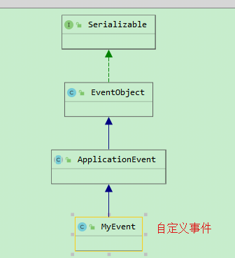
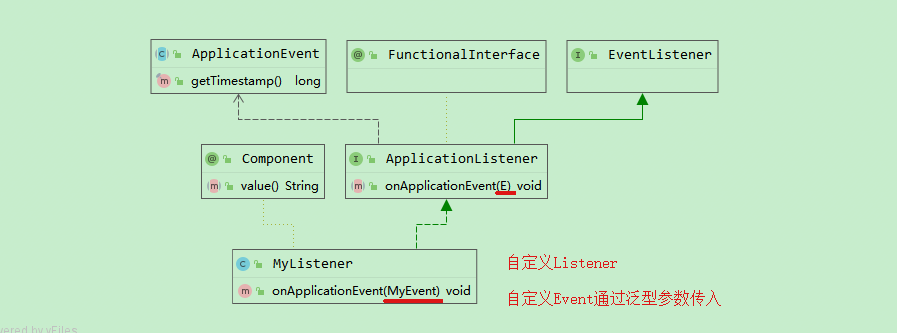

### spring Event&Listener
spring事件是基于事件/监听器编程模型，在这个模型中，有几个重要的角色，事件（`ApplicationEvent`），应用事件监听器（`ApplicationListener`），以及事件发布者（`ApplicationContext`）。

* 事件（event）可以封装和传递监听器中要处理的参数，如对象或字符串，并作为监听器中监听的目标。
* 监听器（listener）具体根据事件发生的业务处理模块，这里可以接收处理事件中封装的对象或字符串。
* 事件发布者（publisher）事件发生的触发者。

#### spring自有的Event
| Event                        | Explanation                                                  |
| :--------------------------- | :----------------------------------------------------------- |
| `ContextRefreshedEvent`      | Published when the `ApplicationContext` is initialized or refreshed (for example, by using the `refresh()` method on the `ConfigurableApplicationContext` interface). Here, “initialized” means that all beans are loaded, post-processor beans are detected and activated, singletons are pre-instantiated, and the `ApplicationContext` object is ready for use. As long as the context has not been closed, a refresh can be triggered multiple times, provided that the chosen `ApplicationContext` actually supports such “hot” refreshes. For example, `XmlWebApplicationContext` supports hot refreshes, but `GenericApplicationContext` does not. |
| `ContextStartedEvent`        | Published when the `ApplicationContext` is started by using the `start()` method on the `ConfigurableApplicationContext` interface. Here, “started” means that all `Lifecycle` beans receive an explicit start signal. Typically, this signal is used to restart beans after an explicit stop, but it may also be used to start components that have not been configured for autostart (for example, components that have not already started on initialization). |
| `ContextStoppedEvent`        | Published when the `ApplicationContext` is stopped by using the `stop()` method on the `ConfigurableApplicationContext` interface. Here, “stopped” means that all `Lifecycle` beans receive an explicit stop signal. A stopped context may be restarted through a `start()` call. |
| `ContextClosedEvent`         | Published when the `ApplicationContext` is being closed by using the `close()` method on the `ConfigurableApplicationContext` interface or via a JVM shutdown hook. Here, "closed" means that all singleton beans will be destroyed. Once the context is closed, it reaches its end of life and cannot be refreshed or restarted. |
| `RequestHandledEvent`        | A web-specific event telling all beans that an HTTP request has been serviced. This event is published after the request is complete. This event is only applicable to web applications that use Spring’s `DispatcherServlet`. |
| `ServletRequestHandledEvent` | A subclass of `RequestHandledEvent` that adds Servlet-specific context information. |

#### 自定义Event
1. 继承 `ApplicationEvent`
1. 实现 `ApplicationListener`，同时第一步里自定义的Event通过泛型，传入本步骤里的自定义Listener（或者使用`@EventListener`）
1. `ApplicationContext`进行事件发布：`applicationContext.publishEvent`
1. 或者通过 `ApplicationEventPublisher` 来进行事件发布（通过 `ApplicationEventPublisherAware` 获取 `ApplicationEventPublisher`）：`applicationEventPublisher.publishEvent`
1. 其他：`@Order`来调整监听的顺序

相关代码结构如下：




#### 使用场景
> Spring’s eventing mechanism is designed for simple communication between
  Spring beans within the same application context. However, for more
  sophisticated enterprise integration needs, the separately maintained Spring
  Integration project provides complete support for building lightweight, patternoriented, event-driven architectures that build upon the well-known Spring
  programming model.

同一个应用程序的spring上下文可以使用通信方法。对于更多复杂的企业集成需要，可能需要额外的发布/订阅服务。如消息队列(kafka/mq等)。

#### @EventListener
1. 监听具体事件
    ```
    @EventListener
    public void listen(MyGenericResolvableEvent<?> event) {
        ResolvableType resolvableType = event.getResolvableType();
    }
    ```
1. 监听多个事件，但是有相同的处理逻辑
    ```java
    @EventListener({ContextStartedEvent.class, ContextRefreshedEvent.class})
    public void handleContextStart() {
      // ...
    }
    ```
1. 结合SpEL，可以做到运行时过滤条件进行监听
```java
@EventListener(condition = "#blEvent.content == 'my-event'")
public void processBlockedListEvent(BlockedListEvent blockedListEvent) {
  // notify appropriate parties via notificationAddress...
}
```

#### Ordering Listeners(顺序监听)
监听事件的方法上添加 `@Order` 注解，值越小，优先级越高，越先处理。

#### Asynchronous Listeners(异步监听)
默认情况下，多个事件的监听是串行执行的（单线程）。如果想每一个监听使用单独线程进行处理，则需要使用`@Async`，前提是开启异步`@EnableAsync`。

需要注意的是每一个`@Async`修饰的监听方法，都会使用单独的线程，不同的监听使用的线程也不同。如果部分加，部分不加。则不加`@Async`修饰，则使用主线程，加了的使用单独的线程进行处理。

Be aware of the following limitations when using asynchronous events(局限):
* If an asynchronous event listener throws an Exception, it is not propagated to the caller. See
AsyncUncaughtExceptionHandler for more details.
* Asynchronous event listener methods cannot publish a subsequent event by returning a value.
If you need to publish another event as the result of the processing, inject an
ApplicationEventPublisher to publish the event manually


#### Generic Events
如果事件操作内容相同，但是处理对象不同，可使用同一个事件，传入泛型参数，对不同的参数使用不同的监听。

如果相似的事件监听过多，也会造成整体结构代码的重复，因而出现了 `ResolvableTypeProvider`。


#### MyHub

```java


// springboot的测试方法
@SpringBootTest
@RunWith(SpringRunner.class)
public class ListenerTest {
  @Autowired
  private ApplicationContext applicationContext;

  @Test
  public void testListenner() {
    MyEvent myEvent = new MyEvent("myEvent", 001L, "running~~~");
    applicationContext.publishEvent(myEvent);
  }
}
```


#### 参考
1. [spring doc](https://docs.spring.io/spring-framework/docs/current/reference/html/core.html#spring-core)
2. [Spring ApplicationListener的使用](Spring ApplicationListener的使用)
3. [spring事件之ApplicationListener](https://www.jianshu.com/p/0fb29a27eb61)